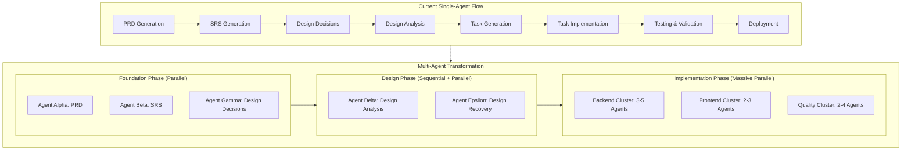
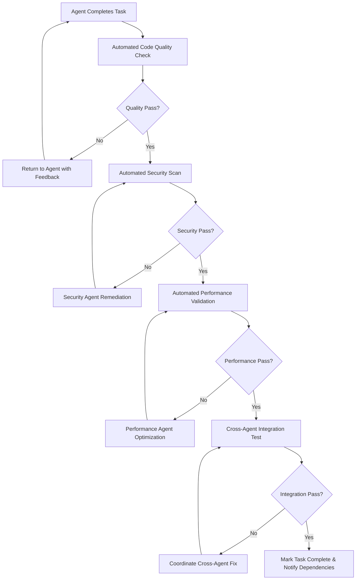

# Multi-Agent Integration Guide

## Objective
Provide step-by-step guidance for integrating multi-agent coordination into existing MVP and Scaling workflows, enabling parallel AI agent implementation with automated task completion and quality assurance.

---

## Integration Overview

### **Current Single-Agent Flow → Multi-Agent Transformation**



---

## Phase 1: Foundation Multi-Agent Integration

### **Enhanced MVP Entry Point for Multi-Agent**
```markdown
# MVP Project Entry Point (Multi-Agent Enhanced)

## Multi-Agent Mode Configuration
```json
{
  "multi_agent_mode": true,
  "agent_coordination": {
    "foundation_parallelization": true,
    "max_parallel_foundation_agents": 3,
    "coordination_timeout": "120_minutes",
    "human_review_consolidation": true
  },
  "quality_enforcement": {
    "cross_agent_validation": true,
    "automated_conflict_resolution": true,
    "performance_budget_enforcement": true
  }
}
```

## Enhanced Next Steps (Multi-Agent Foundation)
1. **Initialize Multi-Agent Coordination System**
   - Setup coordination message bus and state management
   - Initialize task queue and agent registration system
   - Configure quality gates and human escalation protocols

2. **Launch Foundation Agent Cluster (Parallel)**
   - **Agent Alpha**: Generate PRD using collected project data
   - **Agent Beta**: Generate SRS focusing on critical NFRs
   - **Agent Gamma**: Generate design decisions with learning guidance
   - **Coordination**: Shared context synchronization and conflict resolution

3. **Foundation Consolidation Gate**
   - **Human Review**: Validate cross-agent foundation consistency
   - **Integration**: Merge and validate foundation documents
   - **Quality Gate**: Ensure all foundation requirements met

4. **Proceed to Design Phase**
   - Hand off consolidated foundation to design agent cluster
   - Initialize design analysis with multi-agent coordination
```

### **Foundation Agent Coordination Example**
```json
{
  "foundation_coordination": {
    "agent_alpha_prd": {
      "agent_id": "agent-alpha-001",
      "task": "generate_prd_from_project_data",
      "inputs": ["project_initialization_data"],
      "outputs": ["/prd/prd-[project-name].md"],
      "coordination_points": [
        {
          "sync_with": "agent-beta-001",
          "sync_data": "scope_boundaries_and_constraints",
          "sync_frequency": "every_15_minutes"
        },
        {
          "sync_with": "agent-gamma-001", 
          "sync_data": "technical_requirements_and_stack_decisions",
          "sync_frequency": "every_20_minutes"
        }
      ],
      "estimated_duration": "45_minutes"
    },
    "agent_beta_srs": {
      "agent_id": "agent-beta-001",
      "task": "generate_srs_focusing_on_mvp_nfrs",
      "inputs": ["project_initialization_data", "scope_sync_from_alpha"],
      "outputs": ["/srs/srs-[project-name].md"],
      "coordination_points": [
        {
          "sync_with": "agent-alpha-001",
          "sync_data": "performance_and_security_requirements",
          "sync_frequency": "every_15_minutes"
        },
        {
          "sync_with": "agent-gamma-001",
          "sync_data": "technology_stack_nfr_implications",
          "sync_frequency": "every_20_minutes"
        }
      ],
      "estimated_duration": "30_minutes"
    },
    "agent_gamma_design": {
      "agent_id": "agent-gamma-001",
      "task": "generate_design_decisions_with_learning_guidance",
      "inputs": ["project_initialization_data", "requirements_sync_from_alpha_beta"],
      "outputs": ["/decisions/design-decisions-[project-name].md", "/decisions/learning-notes-[project-name].md"],
      "coordination_points": [
        {
          "sync_with": "agent-alpha-001",
          "sync_data": "technology_stack_decisions_and_rationale",
          "sync_frequency": "every_20_minutes"
        },
        {
          "sync_with": "agent-beta-001",
          "sync_data": "technology_choices_impact_on_nfrs",
          "sync_frequency": "every_20_minutes"
        }
      ],
      "estimated_duration": "60_minutes"
    }
  }
}
```

---

## Phase 2: Implementation Multi-Agent Integration

### **Enhanced Task Generation for Multi-Agent**
```markdown
# Enhanced gen-tasks-and-testing.md (Multi-Agent)

## Multi-Agent Task Generation Workflow

1. **Agent Cluster Analysis**: Analyze PRD, SRS, and design decisions to identify agent cluster opportunities
2. **Task Partitioning**: Partition tasks by domain (backend, frontend, quality) and independence
3. **Dependency Mapping**: Create detailed cross-agent dependency graph
4. **Agent Assignment**: Assign tasks to specialized agent clusters with coordination protocols
5. **Generate Multi-Agent Task File**: Create task file with agent coordination metadata

### Multi-Agent Task File Structure
```markdown
# Tasks for [Project Name] - Multi-Agent Implementation

## Agent Cluster Configuration
```json
{
  "agent_clusters": {
    "backend_cluster": {
      "agent_count": 2,
      "specialization": "api_and_service_implementation",
      "task_prefix": "backend",
      "coordination_lead": "agent-backend-001"
    },
    "frontend_cluster": {
      "agent_count": 2,
      "specialization": "ui_and_component_implementation", 
      "task_prefix": "frontend",
      "coordination_lead": "agent-frontend-001"
    },
    "quality_cluster": {
      "agent_count": 2,
      "specialization": "testing_and_validation",
      "task_prefix": "quality",
      "coordination_lead": "agent-test-001"
    }
  },
  "coordination_protocol": {
    "sync_frequency": "every_5_minutes",
    "conflict_resolution": "escalate_to_coordination_system",
    "quality_gates": "cross_cluster_validation_required"
  }
}
```

## Agent Cluster Task Assignments

### Backend Cluster Tasks
- [ ] **Agent Backend-001**: User Service Implementation
  - **Context**: Node.js/Express, PostgreSQL, JWT auth, <100ms response target
  - **Dependencies**: Design decisions complete, database schema approved
  - **Integration Points**: Frontend user components, authentication service
  - **Estimated Duration**: 3 hours
  - **Quality Gates**: Unit tests >90%, integration tests, security scan

- [ ] **Agent Backend-002**: Authentication Service Implementation  
  - **Context**: JWT/OAuth integration, password hashing, session management
  - **Dependencies**: User service interfaces, security requirements from SRS
  - **Integration Points**: All frontend components requiring auth
  - **Estimated Duration**: 2.5 hours
  - **Quality Gates**: Security validation, integration tests, performance validation

### Frontend Cluster Tasks
- [ ] **Agent Frontend-001**: User Interface Components
  - **Context**: React components, design system integration, accessibility compliance
  - **Dependencies**: Design system complete, backend user APIs ready
  - **Integration Points**: Authentication components, shared state management
  - **Estimated Duration**: 4 hours
  - **Quality Gates**: Component tests, accessibility validation, design compliance

- [ ] **Agent Frontend-002**: Authentication UI Implementation
  - **Context**: Login/register forms, error handling, state management
  - **Dependencies**: Authentication APIs ready, design system components
  - **Integration Points**: User components, routing system
  - **Estimated Duration**: 3 hours
  - **Quality Gates**: E2E tests, accessibility compliance, error scenario coverage

### Quality Cluster Tasks  
- [ ] **Agent Test-001**: Automated Test Suite Implementation
  - **Context**: Jest/Cypress setup, CI/CD integration, coverage reporting
  - **Dependencies**: All implementation clusters have testable interfaces
  - **Integration Points**: All agent implementations require test validation
  - **Estimated Duration**: 2 hours
  - **Quality Gates**: >95% test coverage, all critical paths covered

- [ ] **Agent Security-001**: Security & Compliance Validation
  - **Context**: OWASP compliance, vulnerability scanning, penetration testing
  - **Dependencies**: Full system integration complete
  - **Integration Points**: All agents must pass security validation
  - **Estimated Duration**: 1.5 hours
  - **Quality Gates**: Zero critical vulnerabilities, compliance validated
```

### **Agent Coordination During Implementation**
```json
{
  "implementation_coordination": {
    "cross_cluster_synchronization": {
      "api_contract_synchronization": {
        "trigger": "backend_agent_completes_api_endpoint",
        "action": "notify_frontend_agents_with_contract_details",
        "validation": "automated_contract_testing_between_clusters"
      },
      "design_system_synchronization": {
        "trigger": "design_system_component_ready", 
        "action": "notify_all_frontend_agents",
        "validation": "automated_design_compliance_checking"
      },
      "quality_gate_synchronization": {
        "trigger": "implementation_cluster_reaches_quality_milestone",
        "action": "trigger_cross_cluster_integration_testing",
        "validation": "full_system_quality_validation"
      }
    },
    "conflict_prevention": {
      "file_coordination": {
        "strategy": "exclusive_locks_on_shared_files",
        "implementation": "coordination_system_manages_file_access_queue"
      },
      "api_coordination": {
        "strategy": "contract_first_development",
        "implementation": "backend_agents_publish_contracts_before_implementation"
      },
      "integration_coordination": {
        "strategy": "staged_integration_with_validation",
        "implementation": "progressive_integration_with_rollback_capability"
      }
    }
  }
}
```

---

## Phase 3: Quality Assurance Multi-Agent Integration

### **Multi-Agent Quality Validation**
```json
{
  "multi_agent_quality_system": {
    "continuous_quality_monitoring": {
      "per_agent_quality": {
        "code_quality_agent": {
          "monitors": "all_agent_implementations",
          "validates": ["code_style", "complexity", "maintainability"],
          "frequency": "on_every_commit",
          "escalation": "block_integration_on_failure"
        },
        "security_quality_agent": {
          "monitors": "all_security_sensitive_implementations",
          "validates": ["vulnerability_scanning", "compliance_checking", "access_control"],
          "frequency": "on_security_relevant_changes",
          "escalation": "immediate_containment_on_critical_findings"
        },
        "performance_quality_agent": {
          "monitors": "all_performance_critical_implementations",
          "validates": ["response_times", "resource_usage", "scalability"],
          "frequency": "on_performance_relevant_changes",
          "escalation": "coordinate_optimization_on_budget_violation"
        }
      }
    },
    "cross_agent_integration_validation": {
      "contract_testing": {
        "validates": "api_contracts_between_backend_and_frontend_clusters",
        "frequency": "on_interface_changes",
        "automation": "automatic_contract_test_generation_and_execution"
      },
      "end_to_end_testing": {
        "validates": "complete_user_flows_across_all_agent_implementations",
        "frequency": "on_milestone_completion",
        "automation": "automated_e2e_test_execution_with_real_integrations"
      },
      "load_testing": {
        "validates": "system_performance_under_realistic_load",
        "frequency": "before_deployment",
        "automation": "automated_load_test_execution_with_performance_validation"
      }
    }
  }
}
```

### **Automated Quality Gate Progression**


---

## Phase 4: Deployment Multi-Agent Integration

### **Multi-Agent Deployment Coordination**
```json
{
  "deployment_coordination": {
    "deployment_clusters": {
      "infrastructure_cluster": {
        "agents": ["agent-deploy-001", "agent-monitor-001"],
        "responsibilities": ["ci_cd_setup", "monitoring_configuration", "scaling_setup"],
        "coordination": "deploy_in_dependency_order"
      },
      "validation_cluster": {
        "agents": ["agent-validate-001", "agent-smoke-test-001"],
        "responsibilities": ["deployment_validation", "smoke_testing", "rollback_capability"],
        "coordination": "validate_before_traffic_routing"
      }
    },
    "deployment_sequence": {
      "phase_1": {
        "agents": ["agent-deploy-001"],
        "tasks": ["setup_infrastructure", "deploy_backend_services"],
        "validation": "infrastructure_health_check"
      },
      "phase_2": {
        "agents": ["agent-deploy-001"],
        "tasks": ["deploy_frontend_application", "configure_load_balancing"],
        "validation": "application_health_check"
      },
      "phase_3": {
        "agents": ["agent-validate-001", "agent-smoke-test-001"],
        "tasks": ["run_smoke_tests", "validate_full_system", "enable_monitoring"],
        "validation": "full_system_validation"
      }
    }
  }
}
```

---

## Implementation Strategy

### **MVP to Multi-Agent Transformation**
1. **Start with Foundation Parallelization**: Begin with 3 parallel agents for PRD, SRS, and design decisions
2. **Add Implementation Clustering**: Introduce 2-3 agent clusters for backend, frontend, and quality
3. **Scale to Full Multi-Agent**: Expand to 8-12 agents with comprehensive coordination

### **Scaling to Enterprise Multi-Agent** 
1. **Microservices Agent Clusters**: Dedicated agent clusters per microservice
2. **Design System Agent Cluster**: Specialized agents for component library and design governance
3. **Quality Assurance Agent Cluster**: Comprehensive security, performance, and compliance validation
4. **Infrastructure Agent Cluster**: DevOps, monitoring, and deployment automation

### **Success Metrics**
- **Development Speed**: 3-5x faster development through parallel implementation
- **Quality Consistency**: Automated quality gates prevent integration issues
- **Conflict Reduction**: 90%+ reduction in integration conflicts through coordination
- **Human Efficiency**: Focus human attention on architecture and business decisions

---

## Getting Started Checklist

### **Phase 1: Foundation Multi-Agent (Week 1)**
- [ ] Setup coordination system and message bus
- [ ] Configure 3 foundation agents (PRD, SRS, Design Decisions)
- [ ] Implement basic conflict resolution and human escalation
- [ ] Test foundation parallelization with sample project

### **Phase 2: Implementation Multi-Agent (Week 2-3)**
- [ ] Add backend and frontend agent clusters
- [ ] Implement task partitioning and dependency management
- [ ] Setup cross-cluster integration testing
- [ ] Test implementation parallelization with complex project

### **Phase 3: Quality Multi-Agent (Week 4)**
- [ ] Add quality assurance agent cluster
- [ ] Implement automated quality gates and validation
- [ ] Setup performance monitoring and optimization coordination
- [ ] Test full multi-agent system with enterprise complexity

### **Phase 4: Production Multi-Agent (Week 5+)**
- [ ] Add deployment and monitoring agent clusters
- [ ] Implement production deployment coordination
- [ ] Setup comprehensive monitoring and alerting
- [ ] Scale to full enterprise multi-agent system

This integration guide transforms your existing single-agent workflow into a powerful multi-agent system that can implement complex projects in parallel while maintaining quality and preventing conflicts!
