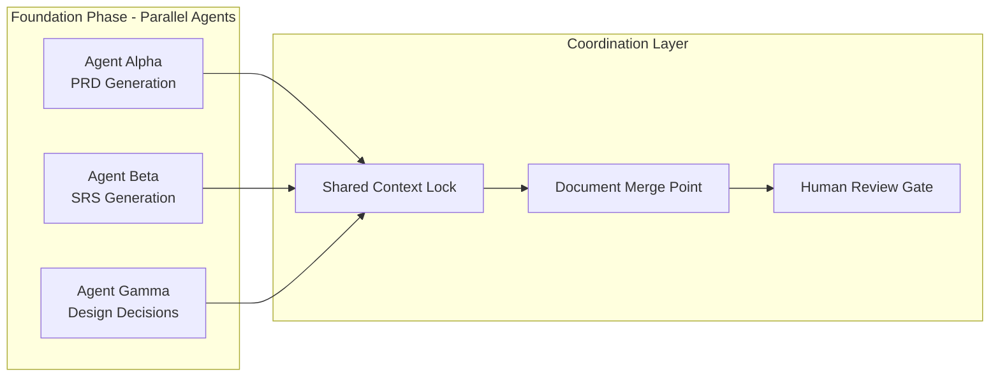
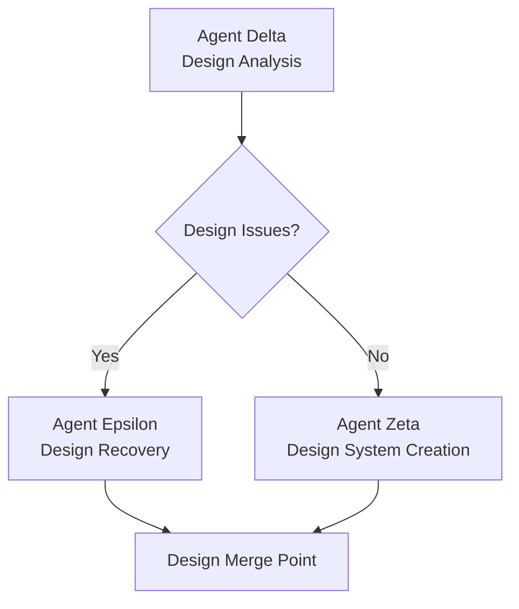
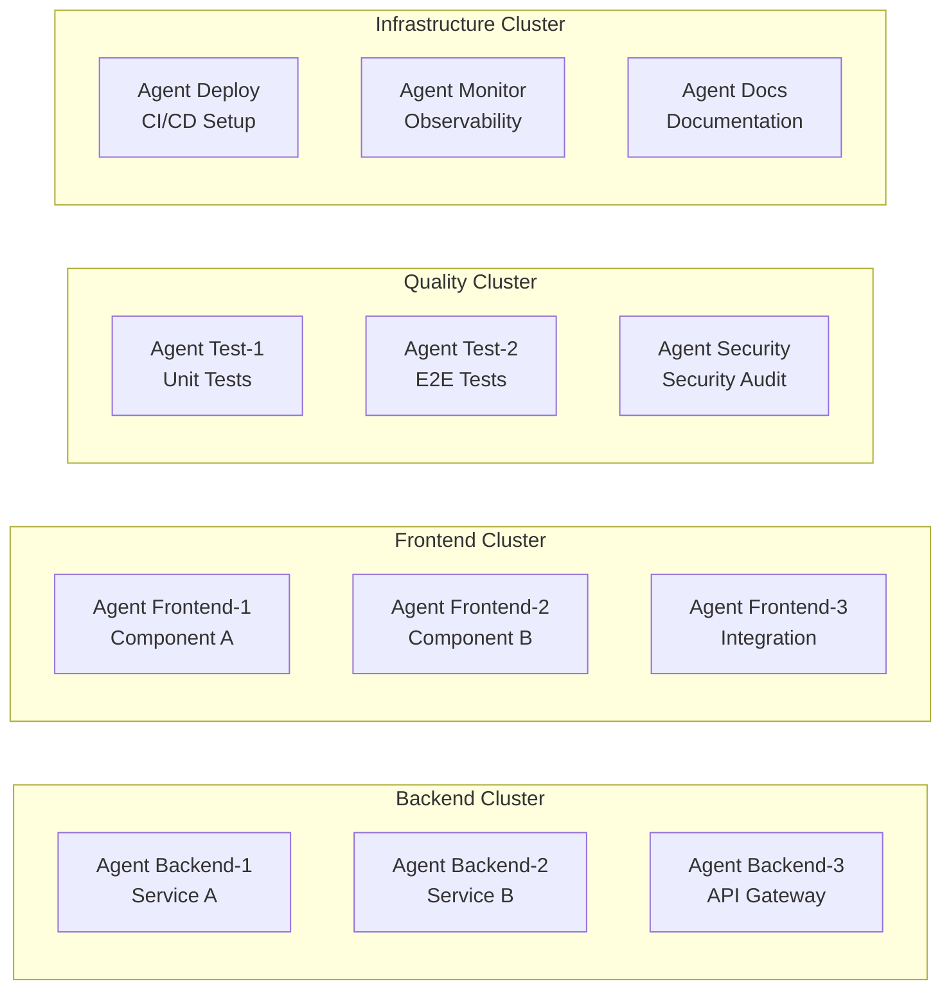

# Multi-Agent Agentic Workflow Protocol

## Objective
Define coordination protocols, task locking mechanisms, and communication standards that enable multiple AI agents to work in parallel on the same project without conflicts, while maintaining quality and enabling automated task completion with comprehensive documentation.

---

## Multi-Agent Workflow Overview

### **Phase 1: Foundation (Parallel Document Generation)**


### **Phase 2: Design Analysis (Sequential + Conditional Parallel)**


### **Phase 3: Task Implementation (Massive Parallel)**


---

## Agent Coordination Protocols

### **1. Agent Registration & Role Assignment**
```json
{
  "agent_id": "agent-backend-001",
  "agent_type": "implementation",
  "specialization": "backend_services",
  "project_id": "project-userauth-mvp",
  "assigned_tasks": ["task-1.1", "task-1.2", "task-1.3"],
  "dependencies": ["agent-design-001", "agent-srs-001"],
  "coordination_channel": "/coordination/backend-cluster",
  "status": "active",
  "last_heartbeat": "2024-01-15T10:30:00Z"
}
```

### **2. Task Locking Mechanism**
```json
{
  "task_locks": {
    "task-1.1-implement-user-service": {
      "locked_by": "agent-backend-001",
      "lock_timestamp": "2024-01-15T10:15:00Z",
      "estimated_completion": "2024-01-15T11:45:00Z",
      "dependencies_met": true,
      "progress_percentage": 65,
      "last_update": "2024-01-15T10:25:00Z"
    }
  },
  "file_locks": {
    "src/services/user/user.service.ts": {
      "locked_by": "agent-backend-001",
      "lock_type": "exclusive_write",
      "related_task": "task-1.1-implement-user-service"
    }
  }
}
```

### **3. Agent Communication Protocol**
```json
{
  "communication_types": {
    "status_update": {
      "frequency": "every_5_minutes",
      "content": ["progress_percentage", "blockers", "completion_estimate"]
    },
    "dependency_request": {
      "trigger": "immediate",
      "content": ["required_interface", "expected_completion", "priority_level"]
    },
    "integration_notification": {
      "trigger": "task_completion",
      "content": ["completed_interface", "integration_points", "testing_status"]
    },
    "conflict_resolution": {
      "trigger": "lock_conflict",
      "content": ["conflict_type", "proposed_resolution", "escalation_needed"]
    }
  }
}
```

---

## Multi-Agent Task File Structure

### **Enhanced Task File with Agent Coordination**
```markdown
# Tasks for [Project Name] - Multi-Agent Coordination

## Agent Coordination Metadata
```json
{
  "multi_agent_mode": true,
  "coordination_version": "1.0",
  "agent_clusters": {
    "foundation": ["agent-alpha", "agent-beta", "agent-gamma"],
    "backend": ["agent-backend-1", "agent-backend-2", "agent-backend-3"],
    "frontend": ["agent-frontend-1", "agent-frontend-2"],
    "quality": ["agent-test-1", "agent-test-2", "agent-security"],
    "infrastructure": ["agent-deploy", "agent-monitor", "agent-docs"]
  },
  "coordination_rules": {
    "max_parallel_tasks_per_cluster": 3,
    "required_approval_gates": ["design_complete", "implementation_complete"],
    "conflict_resolution": "escalate_to_human",
    "progress_sync_interval": "5_minutes"
  }
}
```

## Executive Context (Multi-Agent Distilled)
**System Architecture**: [Architecture decisions affecting all agent clusters]
**Performance Budgets**: [Constraints that all agents must respect]
**Security & Compliance**: [Requirements that guide all agent implementations]
**Integration Points**: [Critical interfaces between agent clusters]
**Quality Gates**: [Validation points requiring multi-agent coordination]

## Agent Cluster Assignments

### Foundation Cluster (Parallel Document Generation)
- [ ] **Agent Alpha**: PRD Generation
  - **Dependencies**: None (can start immediately)
  - **Outputs**: `/prd/prd-[project].md`
  - **Coordination**: Shares project context with Beta and Gamma
  - **Estimated Duration**: 45 minutes

- [ ] **Agent Beta**: SRS Generation  
  - **Dependencies**: None (can start immediately)
  - **Outputs**: `/srs/srs-[project].md`
  - **Coordination**: Validates performance budgets with Alpha
  - **Estimated Duration**: 30 minutes

- [ ] **Agent Gamma**: Design Decisions
  - **Dependencies**: None (can start immediately)
  - **Outputs**: `/decisions/design-decisions-[project].md`
  - **Coordination**: Tech stack decisions affect all other clusters
  - **Estimated Duration**: 60 minutes

### Backend Cluster (Service Implementation)
- [ ] **Agent Backend-1**: User Service Implementation
  - **Dependencies**: Foundation Cluster Complete, Design Analysis Complete
  - **Tasks**: ["task-1.1", "task-1.2", "task-1.3"]
  - **Integration Points**: API contracts with Frontend Cluster
  - **File Ownership**: `src/services/user/*`, `api/user/*`

- [ ] **Agent Backend-2**: Authentication Service  
  - **Dependencies**: Foundation Cluster Complete, User Service Interfaces
  - **Tasks**: ["task-2.1", "task-2.2", "task-2.4"]
  - **Integration Points**: Security contracts with Frontend, shared with Backend-1
  - **File Ownership**: `src/services/auth/*`, `api/auth/*`

### Frontend Cluster (Component Implementation)
- [ ] **Agent Frontend-1**: User Interface Components
  - **Dependencies**: Design System Complete, Backend API Contracts
  - **Tasks**: ["task-3.1", "task-3.2", "task-3.3"]
  - **Integration Points**: Component integration with Frontend-2
  - **File Ownership**: `src/components/user/*`, `src/pages/user/*`

- [ ] **Agent Frontend-2**: Authentication UI
  - **Dependencies**: Design System Complete, Auth Service APIs
  - **Tasks**: ["task-4.1", "task-4.2", "task-4.3"]
  - **Integration Points**: Shared state management with Frontend-1
  - **File Ownership**: `src/components/auth/*`, `src/pages/auth/*`

### Quality Cluster (Testing & Validation)
- [ ] **Agent Test-1**: Automated Test Suite
  - **Dependencies**: Backend APIs Stable, Frontend Components Testable
  - **Tasks**: ["task-5.1", "task-5.2", "task-5.3"]
  - **Integration Points**: Test data coordination with all implementation clusters
  - **File Ownership**: `tests/*`, `cypress/*`

- [ ] **Agent Security**: Security & Compliance Validation
  - **Dependencies**: Full System Integration
  - **Tasks**: ["task-6.1", "task-6.2"]
  - **Integration Points**: Security scanning across all clusters
  - **File Ownership**: `security/*`, audit reports

## Task Dependencies (Multi-Agent Coordination)

### Critical Path (Cross-Agent Dependencies)
1. **Foundation Cluster** → **Design Analysis** → **All Implementation Clusters**
2. **Backend APIs** → **Frontend Integration** → **Quality Validation**
3. **Component Library** → **Frontend Implementation** → **Design Compliance**

### Parallel Execution Windows
- **Foundation Phase**: Alpha, Beta, Gamma can run simultaneously
- **Implementation Phase**: Backend-1, Backend-2, Frontend-1 can run in parallel after dependencies met
- **Validation Phase**: Test-1, Security can run after implementation clusters reach stable state

## Agent Coordination Rules

### **Lock Management**
- **Task Locks**: Agent must acquire task lock before starting work
- **File Locks**: Exclusive write access to prevent conflicts
- **Integration Locks**: Coordination required for shared interfaces

### **Progress Synchronization**
- **Heartbeat Interval**: Every 5 minutes
- **Progress Updates**: Percentage complete, blockers, estimated completion
- **Dependency Notifications**: Alert dependent agents when interfaces are ready

### **Conflict Resolution**
- **Lock Conflicts**: Escalate to coordination system for priority-based resolution
- **Integration Conflicts**: Require multi-agent synchronization meeting
- **Quality Conflicts**: Security and testing agents have veto power

### **Human Gates**
- **Foundation Review**: Human approval before implementation clusters start
- **Integration Review**: Human approval before quality validation
- **Final Review**: Human approval before deployment

## Automated Task Completion Protocol

### **Task Completion Automation**
```json
{
  "automated_completion_criteria": {
    "code_implementation": {
      "requirements": ["tests_passing", "linting_clean", "security_scan_clean"],
      "validation": ["performance_budgets_met", "integration_tests_pass"],
      "documentation": ["api_docs_updated", "changelog_updated"]
    },
    "task_handoff": {
      "notification_agents": ["dependent_agents", "cluster_coordinator"],
      "interface_publication": ["api_contracts", "component_interfaces"],
      "integration_validation": ["contract_testing", "compatibility_verification"]
    }
  }
}
```

### **Automated Documentation Updates**
- **Task Status**: Real-time updates to task completion status
- **Changelog Maintenance**: Automated entry generation with implementation details
- **Interface Documentation**: Automatic API/component documentation generation
- **Progress Reporting**: Human-readable progress summaries for all clusters

### **Quality Automation**
- **Continuous Integration**: Automated testing on every agent commit
- **Security Scanning**: Automated vulnerability and compliance checking
- **Performance Validation**: Automated performance budget enforcement
- **Design Compliance**: Automated design system validation

## Agent Communication Examples

### **Status Update Message**
```json
{
  "message_type": "status_update",
  "from_agent": "agent-backend-001",
  "to_agents": ["coordination_system", "agent-frontend-001"],
  "timestamp": "2024-01-15T10:25:00Z",
  "content": {
    "current_task": "task-1.2-implement-user-crud",
    "progress_percentage": 75,
    "estimated_completion": "2024-01-15T10:45:00Z",
    "completed_interfaces": ["/api/users/create", "/api/users/read"],
    "blockers": [],
    "next_integration_point": "user_service_authentication_interface"
  }
}
```

### **Dependency Request Message**
```json
{
  "message_type": "dependency_request",
  "from_agent": "agent-frontend-001",
  "to_agent": "agent-backend-001",
  "timestamp": "2024-01-15T10:30:00Z",
  "content": {
    "required_interface": "/api/users/profile",
    "required_by": "2024-01-15T11:00:00Z",
    "priority": "blocking",
    "specification": {
      "endpoint": "/api/users/{id}/profile",
      "method": "GET",
      "expected_response": "user_profile_schema"
    }
  }
}
```

### **Completion Notification Message**
```json
{
  "message_type": "task_completion",
  "from_agent": "agent-backend-002",
  "to_agents": ["coordination_system", "agent-frontend-2", "agent-test-1"],
  "timestamp": "2024-01-15T11:15:00Z",
  "content": {
    "completed_task": "task-2.3-implement-jwt-validation",
    "delivered_interfaces": ["/api/auth/validate", "/api/auth/refresh"],
    "integration_ready": true,
    "testing_status": "unit_tests_passing",
    "documentation_updated": ["/docs/api/auth.md", "/docs/security/jwt.md"],
    "next_tasks": ["task-2.4-implement-password-reset"]
  }
}
```

---

## Quality Assurance & Human Oversight

### **Automated Quality Gates**
- **Code Quality**: Linting, formatting, complexity analysis
- **Test Coverage**: Minimum coverage thresholds per cluster
- **Performance**: Automated performance budget validation
- **Security**: Vulnerability scanning and compliance checking
- **Design**: Component design system compliance validation

### **Human Review Points**
- **Foundation Review**: Approve PRD, SRS, and design decisions before implementation
- **Integration Review**: Approve cross-cluster integration before quality validation
- **Quality Review**: Approve security and performance validation before deployment
- **Escalation Review**: Human resolution of agent conflicts and complex technical decisions

### **Risk Mitigation**
- **Agent Failure Recovery**: Automatic task reassignment to backup agents
- **Integration Conflict Resolution**: Human arbitration for incompatible implementations
- **Quality Standard Enforcement**: Automated rejection of substandard implementations
- **Timeline Management**: Dynamic task rebalancing based on agent performance

---

## Implementation Strategy

### **MVP Multi-Agent Implementation**
1. **Phase 1**: Implement foundation cluster coordination (3 parallel agents)
2. **Phase 2**: Add backend cluster coordination (2-3 parallel agents)
3. **Phase 3**: Add frontend cluster coordination (2 parallel agents)
4. **Phase 4**: Add quality cluster coordination (2-3 parallel agents)

### **Scaling Multi-Agent Implementation**
1. **Enterprise Scale**: 8-12 parallel agents across multiple microservices
2. **Design System Scale**: Dedicated design system agents for component library governance
3. **Quality Scale**: Comprehensive security, performance, and compliance agent clusters
4. **Infrastructure Scale**: DevOps and monitoring agent clusters for enterprise deployment

This multi-agent protocol transforms single-agent sequential development into a coordinated parallel development swarm while maintaining quality, preventing conflicts, and enabling full automation with human oversight!
