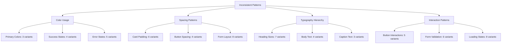

# Workflow: Design Recovery & Consolidation (Scaling)

## Objective
Identify, analyze, and systematically resolve design inconsistencies, component duplication, and technical debt in large-scale codebases. Establish sustainable processes for maintaining design consistency while preserving functionality and user experience.

## When to Use
- **Large Codebase Audits**: When analyzing codebases with >50 components or >20k LOC
- **Multi-Team Consolidation**: When merging components from multiple development teams
- **Design System Migration**: When migrating to a new design system or major version
- **Technical Debt Resolution**: When addressing accumulated design and component debt
- **Platform Consolidation**: When consolidating multiple products or platforms
- **Pre-Launch Quality Assurance**: Before major releases or design system adoption

---

## Enhanced Recovery Workflow

### 1. Comprehensive Inconsistency Analysis
- **Component Duplication Detection**: Identify components serving identical or similar purposes
- **Pattern Inconsistency Mapping**: Analyze variations in design patterns across the codebase
- **Design Token Drift Analysis**: Identify inconsistent use of colors, spacing, typography
- **Accessibility Compliance Audit**: Assess accessibility inconsistencies and violations
- **Performance Impact Assessment**: Analyze performance implications of design inconsistencies
- **User Experience Impact Evaluation**: Assess user-facing impact of design inconsistencies

### 2. Impact Assessment & Prioritization
- **Business Impact Analysis**: Evaluate business consequences of each inconsistency
- **Technical Debt Scoring**: Quantify technical debt impact and complexity
- **User Experience Risk Assessment**: Assess user-facing risks and confusion points
- **Maintenance Burden Evaluation**: Calculate ongoing maintenance costs of inconsistencies
- **Team Productivity Impact**: Assess how inconsistencies affect development velocity
- **Resource Requirement Planning**: Estimate resources needed for each recovery action

### 3. Strategic Consolidation Planning
- **Component Merge Strategy**: Plan systematic component consolidation approach
- **API Standardization**: Design consistent APIs across consolidated components
- **Data Migration Planning**: Plan data and prop migration strategies
- **Backward Compatibility Strategy**: Maintain functionality during transitions
- **Rollout Strategy**: Plan phased rollout to minimize disruption
- **Testing Strategy**: Ensure comprehensive testing during consolidation

### 4. Implementation & Validation
- **Automated Migration Tools**: Create tools to automate repetitive migration tasks
- **Progressive Enhancement**: Implement changes incrementally with validation
- **Quality Assurance**: Validate functionality and design consistency throughout
- **Performance Monitoring**: Monitor performance impact during recovery
- **User Acceptance Testing**: Validate user experience improvements
- **Documentation Updates**: Update all documentation to reflect consolidated state

---

## Scaling Recovery Output Format

```markdown
# Design Recovery Plan (Scaling) - [Project Name]

## Executive Summary
- **Scope**: [codebase size and complexity overview]
- **Critical Issues**: [number and severity of issues found]
- **Estimated Timeline**: [recovery timeline and phases]
- **Resource Requirements**: [team members and time required]
- **Risk Level**: [low|medium|high] - [risk assessment summary]

## Comprehensive Analysis Results

### Component Duplication Analysis
| Component Category | Duplicates Found | Consolidation Opportunity | Impact Level |
|-------------------|------------------|---------------------------|--------------|
| Buttons | 8 variations | Consolidate to 3 variants | High |
| Input Fields | 12 variations | Consolidate to 5 types | Critical |
| Cards | 6 variations | Consolidate to 2 patterns | Medium |
| Navigation | 4 variations | Standardize to 1 pattern | High |

### Pattern Inconsistency Map


### Design Token Drift Analysis
- **Color Inconsistencies**: [47 hardcoded colors vs 12 design tokens]
- **Spacing Inconsistencies**: [23 custom spacing values vs 8 standard values]
- **Typography Inconsistencies**: [15 font-size variations vs 6 standard sizes]
- **Shadow Inconsistencies**: [12 custom shadows vs 4 standard elevations]

### Accessibility Compliance Issues
- **Critical Issues**: [issues that block users with disabilities]
- **Major Issues**: [issues that significantly impact accessibility]
- **Minor Issues**: [issues that could be improved for better accessibility]
- **Compliance Score**: [current WCAG compliance percentage]

### Performance Impact Assessment
- **Bundle Size Impact**: [KB saved by consolidating duplicate components]
- **Runtime Performance**: [rendering performance improvements possible]
- **Network Impact**: [reduced CSS and JS payload estimates]
- **Caching Improvements**: [better caching through consolidation]

## Strategic Consolidation Plan

### Phase 1: Foundation Consolidation (Weeks 1-2)
- **Design Token Standardization**
  - Consolidate color palette to design system standards
  - Standardize spacing system across all components
  - Unify typography scale and hierarchy
  - Establish consistent elevation and shadow system

- **Critical Component Fixes**
  - Consolidate button variations to standard design system
  - Merge input field variations to consistent API
  - Standardize card component patterns
  - Fix accessibility violations in core components

### Phase 2: Pattern Consolidation (Weeks 3-4)
- **Interaction Pattern Standardization**
  - Consolidate loading states to consistent patterns
  - Standardize form validation approaches
  - Unify navigation patterns across application
  - Consolidate modal and dialog patterns

- **Layout Pattern Consolidation**
  - Standardize page layout patterns
  - Consolidate grid and flex layout approaches
  - Unify responsive breakpoint usage
  - Standardize spacing and alignment patterns

### Phase 3: Advanced Consolidation (Weeks 5-6)
- **Complex Component Consolidation**
  - Merge data table variations
  - Consolidate dashboard layout patterns
  - Unify chart and visualization components
  - Standardize complex form patterns

- **Cross-Platform Consistency**
  - Ensure mobile and desktop pattern consistency
  - Consolidate responsive design approaches
  - Unify touch and mouse interaction patterns
  - Standardize platform-specific adaptations

### Phase 4: Quality Assurance & Documentation (Weeks 7-8)
- **Comprehensive Testing**
  - Visual regression testing across all consolidated components
  - Accessibility testing and compliance validation
  - Performance testing and optimization validation
  - Cross-browser and cross-device testing

- **Documentation Updates**
  - Update all component documentation
  - Create migration guides for development teams
  - Document new patterns and usage guidelines
  - Create training materials for design system adoption

## Implementation Strategy

### Automated Migration Tools
```bash
# Component consolidation scripts
npm run consolidate-components --source="old-button" --target="design-system-button"
npm run migrate-props --component="button" --old-api="variant" --new-api="appearance"
npm run update-imports --old="@components/CustomButton" --new="@design-system/Button"

# Design token migration
npm run migrate-tokens --old-colors="legacy-colors.css" --new-colors="design-tokens.css"
npm run find-hardcoded-values --type="colors|spacing|typography"
npm run replace-hardcoded --token-map="token-migration.json"
```

### Quality Assurance Process
1. **Pre-Migration Testing**
   - Capture visual snapshots of all affected components
   - Document current behavior and functionality
   - Create test suites for critical user flows
   - Establish performance baselines

2. **Migration Validation**
   - Visual diff testing after each consolidation
   - Functional testing of consolidated components
   - Performance impact measurement
   - Accessibility compliance verification

3. **Post-Migration Validation**
   - Comprehensive regression testing
   - User acceptance testing with real users
   - Performance monitoring and optimization
   - Documentation accuracy verification

### Risk Mitigation Strategies
- **Gradual Rollout**: Deploy consolidations incrementally with feature flags
- **Rollback Procedures**: Maintain ability to quickly rollback changes
- **Monitoring**: Continuous monitoring of user experience and performance
- **Communication**: Clear communication to all stakeholders throughout process

## Team Coordination & Communication

### Stakeholder Communication Plan
- **Development Teams**: Regular updates on migration progress and requirements
- **Design Teams**: Collaboration on consolidation decisions and validation
- **Product Teams**: Impact assessment and user experience validation
- **QA Teams**: Testing strategy coordination and validation requirements

### Training & Adoption
- **Migration Workshops**: Training sessions for development teams
- **Design System Training**: Education on new patterns and components
- **Code Review Guidelines**: Updated guidelines for post-migration development
- **Support Channels**: Dedicated support for migration questions and issues

## Success Metrics & Validation

### Quantitative Metrics
- **Component Count Reduction**: [target X% reduction in duplicate components]
- **Bundle Size Reduction**: [target X KB reduction in bundle size]
- **Performance Improvement**: [target X% improvement in key metrics]
- **Accessibility Score**: [target WCAG compliance percentage]
- **Development Velocity**: [measure impact on development speed]

### Qualitative Metrics
- **Developer Experience**: [feedback on ease of use and consistency]
- **User Experience**: [user feedback on consistency and usability]
- **Design Consistency**: [visual audit scores and design quality]
- **Maintenance Burden**: [reduction in time spent on inconsistency fixes]

## Post-Recovery Governance

### Ongoing Consistency Maintenance
- **Automated Linting**: Rules to prevent new inconsistencies
- **Design Review Process**: Regular reviews to catch drift early
- **Performance Monitoring**: Ongoing monitoring of consolidation benefits
- **User Feedback Integration**: Regular user feedback on consistency

### Continuous Improvement
- **Regular Audits**: Quarterly consistency audits and assessments
- **Pattern Evolution**: Managed evolution of design patterns
- **New Component Guidelines**: Process for adding new components consistently
- **Cross-Team Coordination**: Regular design system team collaboration
```

---

## AI Agent Directives
- Always perform comprehensive analysis before proposing consolidation strategies
- Prioritize user-facing inconsistencies that impact user experience
- Create detailed migration plans with clear timelines and resource requirements
- Validate that consolidation maintains or improves functionality
- Establish automated tools and processes to prevent future inconsistencies
- Save comprehensive recovery plan to `/design/recovery-[project-name]-scaling.md`
- Coordinate with design system team on consolidation decisions
Set reasoning_effort = high; scaling recovery requires comprehensive planning

---

## Human Review Gate (Required)
- Confirm: comprehensive analysis complete and accurate
- Confirm: consolidation strategy preserves critical functionality
- Confirm: migration timeline and resource requirements realistic
- Confirm: risk mitigation strategies adequate for project scale
- Confirm: team coordination and communication plan approved
- Confirm: success metrics and validation approach appropriate
- Approve proceeding with design recovery implementation

---

## Handoff + Memory Sync
Update agent memory with the following minimal context:

```json
{
  "stage": "design_recovery_scaling",
  "project_name": "[project-name]",
  "recovery_path": "/design/recovery-[project-name]-scaling.md",
  "analysis_results": {
    "duplicate_components": 0,
    "pattern_inconsistencies": 0,
    "token_drift_issues": 0,
    "accessibility_issues": 0
  },
  "consolidation_plan": {
    "phases": 4,
    "timeline_weeks": 8,
    "resource_requirements": "...",
    "risk_level": "low|medium|high"
  },
  "automation_tools": {
    "migration_scripts_ready": true|false,
    "testing_automation_ready": true|false,
    "monitoring_setup_ready": true|false
  },
  "team_coordination": {
    "stakeholder_alignment": true|false,
    "training_plan_ready": true|false,
    "communication_plan_active": true|false
  }
}
```

### Context Seed (for implementation)
Provide this block to development workflow:

```json
{
  "project_name": "[project-name]",
  "recovery_path": "/design/recovery-[project-name]-scaling.md",
  "recovery_required": true,
  "priority": "high",
  "phases_planned": 4,
  "automation_ready": true|false
}
```

---

## Human-in-the-Loop Rule
Pause for explicit approval before:
- Implementing breaking changes that affect multiple teams
- Deprecating components that are widely used
- Making architectural decisions that impact multiple products
- Rolling out changes that affect user-facing functionality
- Otherwise proceed autonomously for analysis and planning

---

## Integration with Scaling Workflow
This recovery workflow integrates with other scaling documents:
- Builds upon analysis from `gen-design-scaling.md`
- Implements patterns established in `gen-design-system-scaling.md`
- Provides input for `tasks-and-testing-scaling.md` recovery tasks
- Supports transition goals from `mvp-to-scaling-transition.md`

---

## Success Criteria
- [ ] All duplicate components consolidated to design system standards
- [ ] Pattern inconsistencies resolved across entire codebase
- [ ] Design token usage standardized with zero hardcoded values
- [ ] Accessibility compliance achieved for all components
- [ ] Performance improvements validated and documented
- [ ] Team training completed and adoption validated
- [ ] Governance processes established to prevent future drift

---

## Start Here
Use this workflow when significant design inconsistencies are detected in scaling projects or when preparing for design system adoption. Ensure comprehensive analysis is complete before implementing recovery strategies.
