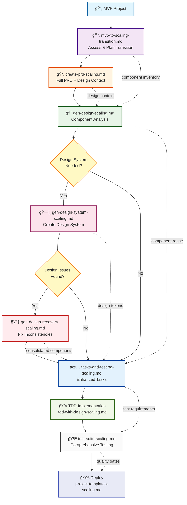
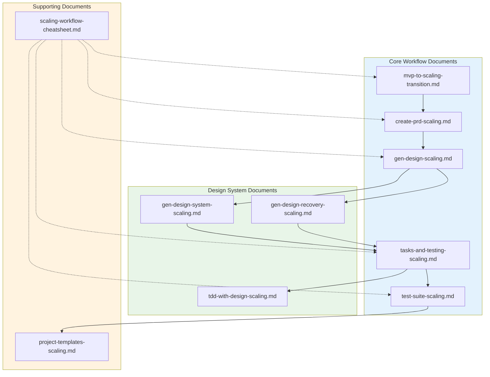

# Enhanced Scaling Workflow Diagram (Design-Aware)

## Complete Workflow Overview

```mermaid
flowchart TD
    A[💡 MVP Project] --> B[🔄 mvp-to-scaling-transition.md<br/>Assess & Plan Transition]
    B --> C[📄 create-prd-scaling.md<br/>Full PRD + Design Context]
    C --> D[🨠gen-design-scaling.md<br/>Component Analysis]
    D --> E{Design System<br/>Needed?}
    E -->|Yes| F[ğŸ—ï¸ gen-design-system-scaling.md<br/>Create Design System]
    E -->|No| G[✅ tasks-and-testing-scaling.md<br/>Enhanced Tasks]
    F --> H{Design Issues<br/>Found?}
    H -->|Yes| I[🔧 gen-design-recovery-scaling.md<br/>Fix Inconsistencies]
    H -->|No| G
    I --> G
    G --> J[💻 TDD Implementation<br/>tdd-with-design-scaling.md]
    J --> K[🧪 test-suite-scaling.md<br/>Comprehensive Testing]
    K --> L[🚀 Deploy<br/>project-templates-scaling.md]

    %% Design-aware cross-links
    B -. component inventory .-> D
    C -. design context .-> D
    D -. component reuse .-> G
    F -. design tokens .-> G
    I -. consolidated components .-> G
    G -. test requirements .-> K
    K -. quality gates .-> L

    %% Styling
    style A fill:#e1f5fe,stroke:#01579b,stroke-width:2px
    style B fill:#f3e5f5,stroke:#4a148c,stroke-width:2px
    style C fill:#fff3e0,stroke:#e65100,stroke-width:2px
    style D fill:#e8f5e8,stroke:#1b5e20,stroke-width:2px
    style E fill:#fff9c4,stroke:#f57f17,stroke-width:2px
    style F fill:#fce4ec,stroke:#880e4f,stroke-width:2px
    style H fill:#fff9c4,stroke:#f57f17,stroke-width:2px
    style I fill:#ffebee,stroke:#c62828,stroke-width:2px
    style G fill:#e3f2fd,stroke:#0d47a1,stroke-width:2px
    style J fill:#f1f8e9,stroke:#33691e,stroke-width:2px
    style K fill:#fafafa,stroke:#424242,stroke-width:2px
    style L fill:#e8eaf6,stroke:#3f51b5,stroke-width:2px
```

## Workflow Phases Breakdown

```mermaid
flowchart LR
    subgraph Phase1 ["Phase 1: Transition"]
        P1A[MVP Assessment]
        P1B[Component Inventory]
        P1C[Design Debt Analysis]
    end

    subgraph Phase2 ["Phase 2: Design Foundation"]
        P2A[PRD with Design Context]
        P2B[Component Analysis]
        P2C[Design System Creation]
        P2D[Design Recovery]
    end

    subgraph Phase3 ["Phase 3: Implementation"]
        P3A[Enhanced Task Generation]
        P3B[Design-Aware TDD]
        P3C[Comprehensive Testing]
    end

    subgraph Phase4 ["Phase 4: Deployment"]
        P4A[Quality Validation]
        P4B[Design System Compliance]
        P4C[Production Deployment]
    end

    Phase1 --> Phase2
    Phase2 --> Phase3
    Phase3 --> Phase4

    style Phase1 fill:#e1f5fe,stroke:#01579b
    style Phase2 fill:#e8f5e8,stroke:#1b5e20
    style Phase3 fill:#fff3e0,stroke:#e65100
    style Phase4 fill:#f3e5f5,stroke:#4a148c
```

## Document Integration Map

```mermaid
graph TB
    subgraph Core ["Core Workflow Documents"]
        A1[mvp-to-scaling-transition.md]
        A2[create-prd-scaling.md]
        A3[gen-design-scaling.md]
        A4[tasks-and-testing-scaling.md]
        A5[test-suite-scaling.md]
    end

    subgraph Design ["Design System Documents"]
        B1[gen-design-system-scaling.md]
        B2[gen-design-recovery-scaling.md]
        B3[tdd-with-design-scaling.md]
    end

    subgraph Support ["Supporting Documents"]
        C1[project-templates-scaling.md]
        C2[scaling-workflow-cheatsheet.md]
    end

    A1 --> A2
    A2 --> A3
    A3 --> B1
    A3 --> B2
    B1 --> A4
    B2 --> A4
    A4 --> B3
    A4 --> A5
    A5 --> C1

    C2 -.-> A1
    C2 -.-> A2
    C2 -.-> A3
    C2 -.-> A4
    C2 -.-> A5

    style Core fill:#e3f2fd
    style Design fill:#e8f5e8
    style Support fill:#fff3e0
```
