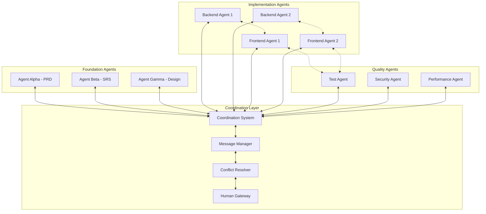

# Multi-Agent Communication & Coordination System

## Objective
Define comprehensive communication protocols, coordination mechanisms, and conflict resolution systems that enable multiple AI agents to collaborate effectively on complex projects while preventing conflicts and ensuring quality outcomes.

---

## Agent Communication Architecture

### **Communication Topology**


### **Communication Protocol Stack**
```json
{
  "communication_layers": {
    "transport_layer": {
      "protocol": "websocket_with_fallback_to_http",
      "encryption": "tls_1.3",
      "authentication": "agent_certificates",
      "message_ordering": "guaranteed_delivery_order"
    },
    "message_layer": {
      "format": "json_with_schema_validation",
      "compression": "gzip_for_large_payloads",
      "versioning": "semantic_versioning_compatibility",
      "routing": "topic_based_routing_with_direct_messaging"
    },
    "coordination_layer": {
      "consensus": "raft_consensus_for_critical_decisions",
      "state_management": "distributed_state_machine",
      "conflict_resolution": "priority_based_with_human_escalation",
      "health_monitoring": "heartbeat_with_failure_detection"
    }
  }
}
```

---

## Message Types & Protocols

### **Core Message Types**
```json
{
  "message_types": {
    "agent_lifecycle": {
      "agent_registration": {
        "purpose": "register_new_agent_with_capabilities",
        "required_fields": ["agent_id", "agent_type", "capabilities", "project_id"],
        "response_expected": true,
        "priority": "high"
      },
      "agent_heartbeat": {
        "purpose": "maintain_agent_health_status",
        "required_fields": ["agent_id", "status", "current_task", "resource_usage"],
        "response_expected": false,
        "frequency": "every_30_seconds"
      },
      "agent_shutdown": {
        "purpose": "graceful_agent_shutdown_notification",
        "required_fields": ["agent_id", "reason", "task_handoff_plan"],
        "response_expected": true,
        "priority": "high"
      }
    },
    "task_coordination": {
      "task_claim": {
        "purpose": "request_exclusive_access_to_task",
        "required_fields": ["agent_id", "task_id", "estimated_duration", "dependencies"],
        "response_expected": true,
        "timeout": "30_seconds"
      },
      "task_progress_update": {
        "purpose": "report_task_implementation_progress",
        "required_fields": ["agent_id", "task_id", "progress_percentage", "blockers"],
        "response_expected": false,
        "frequency": "every_5_minutes"
      },
      "task_completion": {
        "purpose": "report_task_completion_with_artifacts",
        "required_fields": ["agent_id", "task_id", "completion_artifacts", "integration_points"],
        "response_expected": true,
        "priority": "high"
      },
      "dependency_request": {
        "purpose": "request_interface_or_artifact_from_another_agent",
        "required_fields": ["requesting_agent", "target_agent", "required_interface", "deadline"],
        "response_expected": true,
        "priority": "medium"
      }
    },
    "quality_coordination": {
      "quality_gate_request": {
        "purpose": "request_quality_validation_for_implementation",
        "required_fields": ["agent_id", "artifact_location", "validation_type", "success_criteria"],
        "response_expected": true,
        "timeout": "10_minutes"
      },
      "quality_gate_result": {
        "purpose": "report_quality_validation_results",
        "required_fields": ["validator_agent", "artifact_id", "validation_result", "recommendations"],
        "response_expected": false,
        "priority": "high"
      },
      "performance_alert": {
        "purpose": "alert_performance_budget_violation",
        "required_fields": ["monitoring_agent", "metric_type", "current_value", "budget_limit"],
        "response_expected": true,
        "priority": "critical"
      }
    },
    "integration_coordination": {
      "interface_ready": {
        "purpose": "notify_interface_availability_for_integration",
        "required_fields": ["provider_agent", "interface_specification", "documentation_url", "test_endpoints"],
        "response_expected": false,
        "priority": "medium"
      },
      "integration_test_request": {
        "purpose": "request_cross_agent_integration_testing",
        "required_fields": ["requesting_agent", "integration_partners", "test_scenarios", "success_criteria"],
        "response_expected": true,
        "timeout": "15_minutes"
      },
      "integration_conflict": {
        "purpose": "report_interface_or_integration_conflict",
        "required_fields": ["reporting_agent", "conflict_type", "conflicting_agents", "impact_assessment"],
        "response_expected": true,
        "priority": "high"
      }
    }
  }
}
```

### **Message Schema Examples**
```json
{
  "task_claim_message": {
    "message_id": "msg-001-task-claim-user-service",
    "message_type": "task_claim",
    "timestamp": "2024-01-15T10:15:00Z",
    "from_agent": "agent-backend-001",
    "to_agent": "coordination_system",
    "payload": {
      "agent_id": "agent-backend-001",
      "task_id": "task-1.2-implement-user-crud",
      "estimated_duration": "90_minutes",
      "dependencies": ["task-1.1-design-user-schema"],
      "capabilities_required": ["typescript", "postgresql", "express"],
      "resource_requirements": {
        "cpu_cores": 2,
        "memory_gb": 4,
        "disk_gb": 10
      },
      "integration_commitments": [
        {
          "interface": "user_api_contract",
          "delivery_time": "2024-01-15T11:45:00Z",
          "dependent_agents": ["agent-frontend-001", "agent-test-001"]
        }
      ]
    },
    "response_required": true,
    "response_timeout": "30_seconds",
    "priority": "medium"
  },
  
  "interface_ready_message": {
    "message_id": "msg-002-interface-ready-user-api",
    "message_type": "interface_ready",
    "timestamp": "2024-01-15T11:45:00Z",
    "from_agent": "agent-backend-001",
    "to_agents": ["agent-frontend-001", "agent-test-001", "coordination_system"],
    "payload": {
      "provider_agent": "agent-backend-001",
      "completed_task": "task-1.2-implement-user-crud",
      "interface_specification": {
        "name": "User API",
        "version": "1.0.0",
        "openapi_spec_url": "/docs/api/users.yaml",
        "base_url": "http://localhost:3001/api/users",
        "authentication": "bearer_token_required"
      },
      "delivered_endpoints": [
        {
          "method": "POST",
          "path": "/api/users",
          "purpose": "create_new_user",
          "test_example": "curl -X POST http://localhost:3001/api/users -d '{\"name\":\"test\"}'"
        },
        {
          "method": "GET",
          "path": "/api/users/{id}",
          "purpose": "retrieve_user_by_id",
          "test_example": "curl http://localhost:3001/api/users/123"
        }
      ],
      "integration_guidelines": {
        "error_handling": "standard_http_status_codes_with_error_objects",
        "rate_limiting": "100_requests_per_minute_per_client",
        "data_validation": "json_schema_validation_enabled"
      },
      "testing_artifacts": {
        "postman_collection": "/tests/postman/user-api.json",
        "integration_tests": "/tests/integration/user-api.test.ts",
        "mock_server": "http://localhost:3002/mock/users"
      }
    },
    "priority": "medium"
  },
  
  "integration_conflict_message": {
    "message_id": "msg-003-conflict-auth-integration",
    "message_type": "integration_conflict",
    "timestamp": "2024-01-15T12:30:00Z",
    "from_agent": "agent-frontend-001",
    "to_agent": "coordination_system",
    "payload": {
      "reporting_agent": "agent-frontend-001",
      "conflict_type": "interface_incompatibility",
      "conflict_description": "Authentication service expects Bearer token in Authorization header, but User service provides JWT in custom X-Auth-Token header",
      "conflicting_agents": ["agent-backend-001", "agent-backend-002"],
      "affected_functionality": ["user_profile_access", "user_preferences_management"],
      "impact_assessment": {
        "severity": "blocking",
        "affected_tasks": ["task-3.1-implement-user-profile-ui", "task-3.2-implement-user-settings"],
        "estimated_resolution_time": "2_hours",
        "workaround_available": false
      },
      "proposed_resolutions": [
        {
          "resolution": "standardize_on_authorization_bearer_header",
          "required_changes": ["update_user_service_auth_middleware"],
          "impact": "minimal_backend_change",
          "estimated_effort": "30_minutes"
        },
        {
          "resolution": "create_auth_adapter_in_frontend",
          "required_changes": ["add_token_transformation_layer"],
          "impact": "additional_frontend_complexity",
          "estimated_effort": "60_minutes"
        }
      ]
    },
    "response_required": true,
    "priority": "high"
  }
}
```

---

## Coordination System Architecture

### **Coordination State Management**
```json
{
  "coordination_state": {
    "project_state": {
      "project_id": "project-userauth-mvp",
      "current_phase": "implementation",
      "active_agents": ["agent-backend-001", "agent-frontend-001", "agent-test-001"],
      "completed_milestones": ["foundation_complete", "design_analysis_complete"],
      "next_milestone": "backend_services_complete",
      "estimated_completion": "2024-01-20T16:00:00Z"
    },
    "task_assignment_state": {
      "available_tasks": ["task-4.1", "task-5.2", "task-6.1"],
      "assigned_tasks": {
        "task-1.2": "agent-backend-001",
        "task-3.1": "agent-frontend-001",
        "task-5.1": "agent-test-001"
      },
      "blocked_tasks": {
        "task-3.2": {
          "blocked_by": ["task-1.2", "task-2.1"],
          "blocking_reason": "requires_user_and_auth_apis",
          "estimated_unblock": "2024-01-15T14:00:00Z"
        }
      },
      "dependency_graph": {
        "task-1.2": {
          "depends_on": ["task-1.1"],
          "blocks": ["task-2.1", "task-3.1", "task-5.1"]
        }
      }
    },
    "resource_allocation": {
      "cpu_allocation": {
        "total_available": 16,
        "allocated": {
          "agent-backend-001": 4,
          "agent-frontend-001": 3,
          "agent-test-001": 2
        },
        "available": 7
      },
      "memory_allocation": {
        "total_available_gb": 32,
        "allocated_gb": {
          "agent-backend-001": 8,
          "agent-frontend-001": 6,
          "agent-test-001": 4
        },
        "available_gb": 14
      }
    },
    "quality_gates_status": {
      "code_quality": {
        "status": "passing",
        "last_validation": "2024-01-15T12:00:00Z",
        "next_validation": "2024-01-15T12:30:00Z"
      },
      "integration_tests": {
        "status": "passing",
        "success_rate": "100%",
        "last_run": "2024-01-15T12:15:00Z"
      },
      "performance_budgets": {
        "status": "within_limits",
        "api_response_times": "avg_85ms",
        "frontend_performance": "lighthouse_score_92"
      }
    }
  }
}
```

### **Task Assignment Algorithm**
```json
{
  "task_assignment_algorithm": {
    "priority_factors": {
      "task_priority": {
        "weight": 0.4,
        "scoring": "critical=100, high=75, medium=50, low=25"
      },
      "agent_capability_match": {
        "weight": 0.3,
        "scoring": "perfect_match=100, good_match=75, partial_match=50, poor_match=25"
      },
      "dependency_readiness": {
        "weight": 0.2,
        "scoring": "all_dependencies_ready=100, some_ready=50, none_ready=0"
      },
      "agent_availability": {
        "weight": 0.1,
        "scoring": "fully_available=100, partially_available=50, busy=0"
      }
    },
    "assignment_rules": [
      {
        "rule": "prefer_agent_with_highest_capability_match",
        "condition": "multiple_capable_agents_available"
      },
      {
        "rule": "block_assignment_if_dependencies_not_ready",
        "condition": "task_has_unmet_dependencies"
      },
      {
        "rule": "load_balance_across_available_agents",
        "condition": "multiple_tasks_of_similar_priority"
      },
      {
        "rule": "prioritize_critical_path_tasks",
        "condition": "project_timeline_at_risk"
      }
    ],
    "conflict_resolution": [
      {
        "conflict": "multiple_agents_request_same_task",
        "resolution": "assign_to_agent_with_highest_capability_score"
      },
      {
        "conflict": "agent_overloaded_with_critical_task",
        "resolution": "redistribute_lower_priority_tasks_to_other_agents"
      },
      {
        "conflict": "dependency_chain_deadlock",
        "resolution": "escalate_to_human_for_architecture_review"
      }
    ]
  }
}
```

---

## Conflict Resolution System

### **Conflict Detection & Classification**
```json
{
  "conflict_detection": {
    "conflict_types": {
      "resource_conflicts": {
        "file_lock_conflict": {
          "detection": "multiple_agents_attempt_exclusive_file_access",
          "severity": "medium",
          "auto_resolution": "queue_access_based_on_task_priority"
        },
        "resource_exhaustion": {
          "detection": "agent_resource_usage_exceeds_allocation",
          "severity": "high",
          "auto_resolution": "throttle_agent_or_redistribute_tasks"
        },
        "api_rate_limiting": {
          "detection": "agent_exceeds_external_api_rate_limits",
          "severity": "medium",
          "auto_resolution": "implement_backoff_and_retry_with_coordination"
        }
      },
      "integration_conflicts": {
        "interface_incompatibility": {
          "detection": "contract_test_failure_between_agents",
          "severity": "high",
          "auto_resolution": "attempt_automatic_adapter_generation"
        },
        "breaking_change": {
          "detection": "api_change_breaks_dependent_implementations",
          "severity": "critical",
          "auto_resolution": "coordinate_versioning_strategy_with_affected_agents"
        },
        "circular_dependency": {
          "detection": "task_dependency_graph_contains_cycles",
          "severity": "critical",
          "auto_resolution": "escalate_to_human_for_architecture_refactoring"
        }
      },
      "quality_conflicts": {
        "performance_budget_violation": {
          "detection": "implementation_exceeds_performance_targets",
          "severity": "high",
          "auto_resolution": "coordinate_optimization_effort_across_affected_agents"
        },
        "security_vulnerability": {
          "detection": "security_scan_identifies_vulnerabilities",
          "severity": "critical",
          "auto_resolution": "immediately_block_affected_implementations_and_coordinate_fixes"
        },
        "test_coverage_drop": {
          "detection": "code_changes_reduce_test_coverage_below_threshold",
          "severity": "medium",
          "auto_resolution": "require_additional_tests_before_task_completion"
        }
      }
    }
  }
}
```

### **Automated Conflict Resolution**
```json
{
  "conflict_resolution_strategies": {
    "file_lock_conflicts": {
      "strategy": "priority_based_queuing",
      "implementation": {
        "queue_requests": "order_by_task_priority_and_timestamp",
        "timeout_handling": "auto_release_locks_after_timeout",
        "escalation": "human_intervention_after_multiple_timeout_failures"
      }
    },
    "interface_compatibility": {
      "strategy": "automatic_adapter_generation",
      "implementation": {
        "analyze_incompatibility": "identify_specific_interface_mismatches",
        "generate_adapter": "create_transformation_layer_for_data_format_conversion",
        "validate_adapter": "run_integration_tests_with_generated_adapter",
        "fallback": "escalate_to_human_if_adapter_generation_fails"
      }
    },
    "performance_conflicts": {
      "strategy": "collaborative_optimization",
      "implementation": {
        "identify_bottlenecks": "profile_performance_across_all_agent_implementations",
        "coordinate_optimization": "assign_optimization_tasks_to_responsible_agents",
        "validate_improvements": "run_performance_tests_to_confirm_budget_compliance",
        "resource_reallocation": "adjust_performance_budgets_if_optimization_insufficient"
      }
    },
    "security_conflicts": {
      "strategy": "immediate_containment_and_coordinated_remediation",
      "implementation": {
        "containment": "immediately_block_vulnerable_code_from_integration",
        "notification": "alert_all_potentially_affected_agents",
        "coordinated_fix": "assign_security_remediation_tasks_with_high_priority",
        "validation": "require_security_validation_before_reintegration"
      }
    }
  }
}
```

### **Human Escalation Protocols**
```json
{
  "human_escalation": {
    "escalation_triggers": {
      "automatic_escalation": [
        {
          "condition": "conflict_unresolved_after_3_automatic_attempts",
          "escalation_level": "technical_lead",
          "response_time_sla": "30_minutes"
        },
        {
          "condition": "critical_security_vulnerability_detected",
          "escalation_level": "security_team_and_project_lead",
          "response_time_sla": "15_minutes"
        },
        {
          "condition": "project_timeline_impact_exceeds_20_percent",
          "escalation_level": "project_manager_and_stakeholders",
          "response_time_sla": "2_hours"
        }
      ],
      "manual_escalation": [
        {
          "trigger": "agent_requests_human_decision",
          "escalation_level": "domain_expert",
          "response_time_sla": "1_hour"
        },
        {
          "trigger": "architecture_decision_required",
          "escalation_level": "technical_architect",
          "response_time_sla": "4_hours"
        }
      ]
    },
    "escalation_communication": {
      "notification_channels": ["slack", "email", "sms_for_critical"],
      "context_package": {
        "conflict_description": "detailed_technical_description_with_code_examples",
        "impact_assessment": "timeline_quality_and_scope_impact_analysis",
        "resolution_options": "automatically_generated_resolution_alternatives",
        "recommendation": "system_recommended_resolution_with_rationale"
      },
      "response_tracking": {
        "acknowledgment_required": "human_must_acknowledge_receipt",
        "decision_deadline": "explicit_deadline_for_human_decision",
        "automatic_fallback": "default_action_if_no_human_response_within_deadline"
      }
    }
  }
}
```

---

## Quality Assurance & Monitoring

### **Multi-Agent Quality Coordination**
```json
{
  "quality_coordination": {
    "continuous_quality_monitoring": {
      "code_quality": {
        "monitoring_agents": ["agent-quality-code"],
        "validation_frequency": "on_every_commit",
        "quality_metrics": ["complexity", "maintainability", "test_coverage", "code_style"],
        "enforcement": "block_integration_on_quality_gate_failure"
      },
      "integration_quality": {
        "monitoring_agents": ["agent-quality-integration"],
        "validation_frequency": "on_interface_change",
        "quality_metrics": ["contract_compliance", "performance_impact", "backward_compatibility"],
        "enforcement": "require_coordination_before_breaking_changes"
      },
      "security_quality": {
        "monitoring_agents": ["agent-security"],
        "validation_frequency": "continuous_scanning",
        "quality_metrics": ["vulnerability_detection", "compliance_validation", "access_control_verification"],
        "enforcement": "immediate_containment_on_security_issues"
      }
    },
    "cross_agent_validation": {
      "peer_review_simulation": {
        "implementation": "agents_review_each_others_implementations_against_standards",
        "coverage": "all_public_interfaces_and_critical_business_logic",
        "feedback_mechanism": "structured_feedback_with_improvement_suggestions"
      },
      "integration_testing": {
        "implementation": "automated_cross_agent_integration_test_execution",
        "coverage": "all_agent_interaction_points_and_data_flows",
        "failure_handling": "automatic_rollback_and_coordination_for_fixes"
      }
    }
  }
}
```

### **Performance Monitoring & Optimization**
```json
{
  "performance_monitoring": {
    "system_wide_performance": {
      "metrics_collection": {
        "response_times": "per_endpoint_response_time_tracking",
        "throughput": "requests_per_second_capacity_monitoring",
        "resource_usage": "cpu_memory_disk_usage_by_agent",
        "error_rates": "error_rate_tracking_across_all_agent_implementations"
      },
      "performance_budget_enforcement": {
        "budget_validation": "continuous_validation_against_srs_performance_budgets",
        "violation_detection": "automatic_detection_of_budget_violations",
        "optimization_coordination": "coordinate_optimization_efforts_across_affected_agents",
        "budget_adjustment": "coordinated_budget_reallocation_when_necessary"
      }
    },
    "agent_performance_optimization": {
      "resource_optimization": {
        "cpu_optimization": "monitor_and_optimize_agent_cpu_usage",
        "memory_optimization": "monitor_and_optimize_agent_memory_consumption",
        "io_optimization": "monitor_and_optimize_file_and_network_io"
      },
      "coordination_efficiency": {
        "message_optimization": "optimize_inter_agent_message_frequency_and_size",
        "synchronization_optimization": "minimize_coordination_overhead",
        "conflict_minimization": "proactive_conflict_prevention_through_better_coordination"
      }
    }
  }
}
```

This comprehensive communication and coordination system enables multiple AI agents to work together effectively while maintaining quality, preventing conflicts, and ensuring successful project outcomes!
