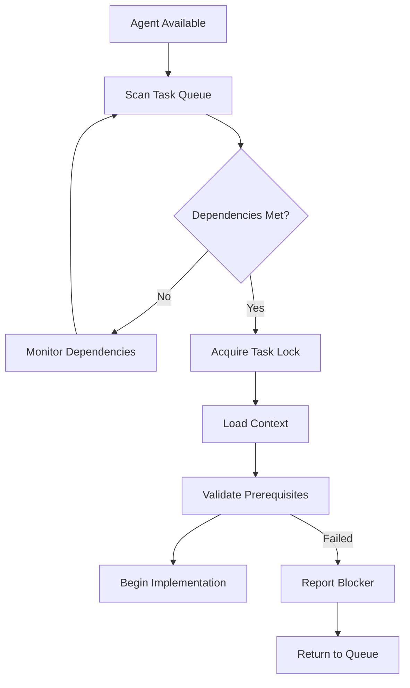
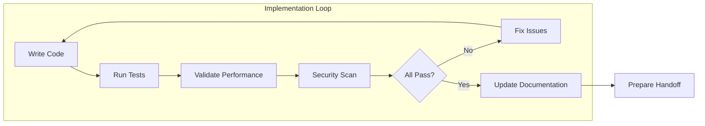
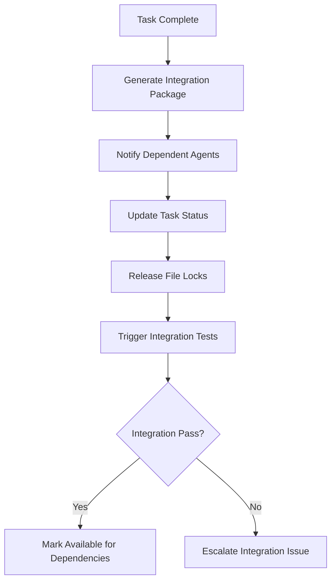

# Automated Task Completion System

## Objective
Define automated task completion protocols that enable AI agents to implement, validate, document, and hand off tasks without human intervention while maintaining quality standards and enabling seamless multi-agent coordination.

---

## Automated Task Completion Workflow

### **1. Task Acquisition & Preparation**


### **2. Implementation with Continuous Validation**


### **3. Automated Handoff & Integration**


---

## Automated Implementation Protocol

### **Task Implementation Automation**
```json
{
  "implementation_protocol": {
    "preparation_phase": {
      "context_loading": {
        "executive_context": "load_task_specific_distilled_context",
        "just_in_time_references": "load_specific_document_sections_as_needed",
        "task_embedded_context": "apply_parent_and_subtask_specific_guidance"
      },
      "environment_setup": {
        "file_structure": "create_required_directories_and_files",
        "dependencies": "install_and_configure_required_packages",
        "configuration": "apply_project_specific_settings"
      },
      "validation_setup": {
        "test_framework": "configure_testing_environment",
        "quality_gates": "setup_linting_formatting_security_checks",
        "performance_monitoring": "configure_performance_budget_validation"
      }
    },
    "implementation_phase": {
      "tdd_enforcement": {
        "red_phase": "write_failing_tests_based_on_acceptance_criteria",
        "green_phase": "implement_minimal_code_to_pass_tests",
        "refactor_phase": "optimize_code_while_maintaining_test_coverage"
      },
      "continuous_validation": {
        "on_every_save": ["lint_check", "type_check", "unit_tests"],
        "on_milestone": ["integration_tests", "performance_validation", "security_scan"],
        "on_completion": ["e2e_tests", "accessibility_validation", "documentation_check"]
      },
      "quality_enforcement": {
        "code_standards": "enforce_project_coding_standards_and_patterns",
        "performance_budgets": "validate_against_established_performance_targets",
        "security_requirements": "validate_against_security_and_compliance_requirements",
        "design_compliance": "validate_against_design_system_and_accessibility_standards"
      }
    },
    "documentation_phase": {
      "code_documentation": {
        "inline_comments": "add_explanatory_comments_for_complex_logic",
        "api_documentation": "generate_or_update_api_documentation",
        "type_definitions": "ensure_comprehensive_type_coverage"
      },
      "integration_documentation": {
        "interface_contracts": "document_public_interfaces_and_contracts",
        "integration_points": "document_external_dependencies_and_connections",
        "usage_examples": "provide_clear_usage_examples_and_patterns"
      },
      "changelog_updates": {
        "task_completion": "record_task_completion_with_implementation_details",
        "api_changes": "document_any_api_or_interface_changes",
        "configuration_changes": "document_any_configuration_or_setup_changes"
      }
    }
  }
}
```

### **Quality Gate Automation**
```json
{
  "quality_gates": {
    "code_quality": {
      "linting": {
        "tool": "eslint_prettier_configured",
        "enforcement": "blocking",
        "auto_fix": true
      },
      "type_safety": {
        "tool": "typescript_strict_mode",
        "enforcement": "blocking",
        "coverage_requirement": "100%_of_public_interfaces"
      },
      "complexity": {
        "tool": "complexity_analysis",
        "enforcement": "warning",
        "max_cyclomatic_complexity": 10
      }
    },
    "test_coverage": {
      "unit_tests": {
        "minimum_coverage": "80%",
        "enforcement": "blocking",
        "critical_paths": "100%_coverage_required"
      },
      "integration_tests": {
        "api_endpoints": "100%_coverage",
        "component_integration": "critical_user_flows",
        "error_scenarios": "all_error_paths_tested"
      },
      "e2e_tests": {
        "user_journeys": "primary_user_flows",
        "cross_browser": "modern_browser_support",
        "accessibility": "wcag_2.1_aa_compliance"
      }
    },
    "performance_validation": {
      "response_times": {
        "api_endpoints": "validate_against_srs_performance_budgets",
        "page_load_times": "validate_against_lighthouse_scores",
        "component_render": "validate_against_react_profiler_budgets"
      },
      "resource_usage": {
        "memory_consumption": "validate_against_memory_budgets",
        "bundle_sizes": "validate_against_bundle_size_budgets",
        "network_requests": "validate_against_network_efficiency_budgets"
      }
    },
    "security_validation": {
      "vulnerability_scanning": {
        "dependency_scan": "audit_all_dependencies_for_vulnerabilities",
        "code_scan": "static_analysis_for_security_vulnerabilities",
        "secrets_scan": "ensure_no_secrets_in_code_or_configuration"
      },
      "compliance_check": {
        "authentication": "validate_proper_authentication_implementation",
        "authorization": "validate_proper_access_control_implementation",
        "data_protection": "validate_data_encryption_and_privacy_compliance"
      }
    }
  }
}
```

### **Automated Documentation Generation**
```json
{
  "documentation_automation": {
    "api_documentation": {
      "openapi_generation": "auto_generate_from_typescript_interfaces_and_decorators",
      "example_generation": "auto_generate_request_response_examples",
      "integration_guides": "auto_generate_client_integration_examples"
    },
    "component_documentation": {
      "storybook_stories": "auto_generate_component_stories_with_props",
      "usage_examples": "auto_generate_component_usage_patterns",
      "accessibility_docs": "auto_generate_accessibility_compliance_information"
    },
    "architecture_documentation": {
      "dependency_graphs": "auto_generate_module_dependency_visualizations",
      "data_flow_diagrams": "auto_generate_data_flow_documentation",
      "integration_maps": "auto_generate_service_integration_diagrams"
    },
    "changelog_automation": {
      "commit_message_parsing": "auto_extract_changes_from_conventional_commits",
      "api_change_detection": "auto_detect_breaking_and_non_breaking_api_changes",
      "migration_guide_generation": "auto_generate_migration_guides_for_breaking_changes"
    }
  }
}
```

---

## Automated Task Handoff Protocol

### **Integration Package Generation**
```json
{
  "integration_package": {
    "completion_metadata": {
      "task_id": "task-1.2-implement-user-crud",
      "agent_id": "agent-backend-001",
      "completion_timestamp": "2024-01-15T11:45:00Z",
      "implementation_duration": "90_minutes",
      "quality_validation_status": "all_gates_passed"
    },
    "delivered_interfaces": {
      "api_endpoints": [
        {
          "endpoint": "/api/users",
          "methods": ["GET", "POST"],
          "openapi_spec": "/docs/api/users.yaml",
          "test_coverage": "100%"
        },
        {
          "endpoint": "/api/users/{id}",
          "methods": ["GET", "PUT", "DELETE"],
          "openapi_spec": "/docs/api/users.yaml",
          "test_coverage": "100%"
        }
      ],
      "data_schemas": [
        {
          "schema_name": "UserSchema",
          "file_path": "/src/schemas/user.ts",
          "validation_rules": "comprehensive",
          "documentation": "/docs/schemas/user.md"
        }
      ],
      "service_interfaces": [
        {
          "interface_name": "UserService",
          "file_path": "/src/services/user.service.ts",
          "public_methods": ["create", "read", "update", "delete", "validate"],
          "integration_examples": "/docs/examples/user-service.md"
        }
      ]
    },
    "integration_requirements": {
      "dependent_services": ["authentication_service", "notification_service"],
      "environment_variables": ["USER_DB_CONNECTION", "USER_ENCRYPTION_KEY"],
      "database_migrations": ["/migrations/001_create_users_table.sql"],
      "configuration_changes": ["/config/user-service.json"]
    },
    "testing_artifacts": {
      "test_data": "/tests/fixtures/user-test-data.json",
      "mock_services": "/tests/mocks/user-service-mocks.ts",
      "integration_tests": "/tests/integration/user-service.test.ts",
      "performance_benchmarks": "/tests/performance/user-service-benchmarks.json"
    },
    "quality_validation_results": {
      "code_quality": {
        "linting_status": "passed",
        "type_coverage": "100%",
        "complexity_score": "acceptable"
      },
      "test_coverage": {
        "unit_tests": "95%",
        "integration_tests": "100%",
        "e2e_coverage": "primary_flows_covered"
      },
      "performance_validation": {
        "response_times": "all_endpoints_under_100ms",
        "memory_usage": "within_allocated_budget",
        "database_performance": "all_queries_optimized"
      },
      "security_validation": {
        "vulnerability_scan": "no_vulnerabilities_found",
        "authentication": "properly_implemented",
        "data_protection": "encryption_and_validation_implemented"
      }
    }
  }
}
```

### **Automated Notification System**
```json
{
  "notification_protocol": {
    "immediate_notifications": [
      {
        "recipient": "agent-frontend-001",
        "message_type": "dependency_ready",
        "content": {
          "ready_interface": "user_service_api",
          "documentation_url": "/docs/api/users.yaml",
          "integration_examples": "/docs/examples/user-service.md",
          "test_environment": "http://localhost:3001/api/users"
        }
      },
      {
        "recipient": "agent-test-001",
        "message_type": "testing_ready",
        "content": {
          "test_interfaces": ["unit_tests", "integration_tests", "e2e_tests"],
          "test_data_available": "/tests/fixtures/user-test-data.json",
          "performance_baselines": "/tests/performance/user-service-benchmarks.json"
        }
      }
    ],
    "coordination_notifications": [
      {
        "recipient": "coordination_system",
        "message_type": "task_completion",
        "content": {
          "completed_task": "task-1.2-implement-user-crud",
          "unlocked_dependencies": ["task-2.1", "task-3.1", "task-5.1"],
          "integration_ready": true,
          "quality_validated": true
        }
      }
    ],
    "human_notifications": [
      {
        "recipient": "human_oversight",
        "message_type": "milestone_completion",
        "content": {
          "milestone": "user_service_implementation_complete",
          "quality_summary": "all_gates_passed",
          "integration_status": "ready_for_dependent_tasks",
          "review_required": false
        }
      }
    ]
  }
}
```

---

## Automated Integration Testing

### **Cross-Agent Integration Validation**
```json
{
  "integration_testing": {
    "contract_testing": {
      "api_contracts": {
        "provider": "agent-backend-001",
        "consumers": ["agent-frontend-001", "agent-frontend-002"],
        "contract_validation": "automatic_on_interface_change",
        "backward_compatibility": "ensure_no_breaking_changes_without_versioning"
      },
      "component_contracts": {
        "provider": "agent-frontend-design-system",
        "consumers": ["agent-frontend-001", "agent-frontend-002"],
        "design_token_validation": "automatic_on_token_change",
        "accessibility_compliance": "automatic_wcag_validation"
      }
    },
    "integration_flows": {
      "user_registration_flow": {
        "participating_agents": ["agent-backend-001", "agent-backend-002", "agent-frontend-001"],
        "test_scenarios": ["happy_path", "validation_errors", "server_errors"],
        "automated_validation": "end_to_end_flow_testing"
      },
      "authentication_flow": {
        "participating_agents": ["agent-backend-002", "agent-frontend-002"],
        "test_scenarios": ["login", "logout", "token_refresh", "password_reset"],
        "security_validation": "automatic_security_testing"
      }
    },
    "performance_integration": {
      "load_testing": {
        "trigger": "after_all_backend_services_complete",
        "scenarios": ["normal_load", "peak_load", "stress_testing"],
        "validation": "performance_budgets_maintained_under_load"
      },
      "end_to_end_performance": {
        "trigger": "after_full_system_integration",
        "scenarios": ["user_journey_performance", "page_load_performance"],
        "validation": "lighthouse_scores_maintained"
      }
    }
  }
}
```

### **Automated Conflict Resolution**
```json
{
  "conflict_resolution": {
    "file_conflicts": {
      "detection": "automatic_on_merge_conflict",
      "resolution_strategy": [
        "attempt_automatic_merge",
        "escalate_to_coordination_system",
        "notify_conflicting_agents",
        "human_escalation_if_unresolvable"
      ]
    },
    "interface_conflicts": {
      "detection": "contract_testing_failure",
      "resolution_strategy": [
        "validate_breaking_change_necessity",
        "coordinate_versioning_strategy",
        "synchronize_dependent_agent_updates",
        "human_escalation_for_architecture_decisions"
      ]
    },
    "resource_conflicts": {
      "detection": "performance_budget_violation",
      "resolution_strategy": [
        "analyze_resource_consumption_by_agent",
        "coordinate_optimization_efforts",
        "rebalance_performance_budgets",
        "human_escalation_for_architecture_changes"
      ]
    }
  }
}
```

---

## Automated Progress Tracking

### **Real-Time Progress Dashboard**
```json
{
  "progress_tracking": {
    "project_overview": {
      "total_tasks": 45,
      "completed_tasks": 23,
      "in_progress_tasks": 8,
      "blocked_tasks": 2,
      "estimated_completion": "2024-01-20T16:00:00Z"
    },
    "agent_cluster_status": {
      "foundation_cluster": {
        "status": "completed",
        "completion_time": "2024-01-15T09:30:00Z",
        "agents": ["agent-alpha", "agent-beta", "agent-gamma"]
      },
      "backend_cluster": {
        "status": "in_progress",
        "progress_percentage": 75,
        "active_agents": ["agent-backend-001", "agent-backend-002"],
        "estimated_completion": "2024-01-16T14:00:00Z"
      },
      "frontend_cluster": {
        "status": "waiting_dependencies",
        "blocked_on": ["backend_api_completion"],
        "ready_agents": ["agent-frontend-001", "agent-frontend-002"]
      }
    },
    "quality_metrics": {
      "overall_test_coverage": "87%",
      "performance_budget_compliance": "95%",
      "security_scan_status": "all_clear",
      "design_system_compliance": "92%"
    }
  }
}
```

### **Automated Reporting**
```json
{
  "automated_reporting": {
    "daily_summary": {
      "schedule": "end_of_day",
      "recipients": ["project_stakeholders", "human_oversight"],
      "content": [
        "tasks_completed_today",
        "blockers_identified_and_resolved",
        "quality_metrics_summary",
        "estimated_completion_updates"
      ]
    },
    "milestone_reports": {
      "schedule": "on_milestone_completion",
      "recipients": ["project_stakeholders", "human_oversight", "dependent_teams"],
      "content": [
        "milestone_achievement_summary",
        "delivered_functionality",
        "integration_readiness",
        "next_phase_preparation"
      ]
    },
    "quality_reports": {
      "schedule": "continuous",
      "recipients": ["quality_team", "human_oversight"],
      "content": [
        "test_coverage_trends",
        "performance_budget_tracking",
        "security_compliance_status",
        "design_system_adoption_metrics"
      ]
    }
  }
}
```

---

## Human Oversight Integration

### **Escalation Protocols**
```json
{
  "human_escalation": {
    "automatic_escalation_triggers": [
      {
        "trigger": "agent_failure_multiple_attempts",
        "escalation_level": "technical_review",
        "response_time": "within_30_minutes"
      },
      {
        "trigger": "cross_agent_integration_failure",
        "escalation_level": "architecture_review",
        "response_time": "within_1_hour"
      },
      {
        "trigger": "security_vulnerability_detected",
        "escalation_level": "immediate_security_review",
        "response_time": "within_15_minutes"
      },
      {
        "trigger": "performance_budget_violation_unresolvable",
        "escalation_level": "performance_architecture_review",
        "response_time": "within_2_hours"
      }
    ],
    "review_checkpoints": [
      {
        "checkpoint": "foundation_completion",
        "review_type": "architecture_validation",
        "auto_proceed_criteria": "all_quality_gates_passed"
      },
      {
        "checkpoint": "integration_completion",
        "review_type": "system_validation",
        "auto_proceed_criteria": "all_integration_tests_passed"
      },
      {
        "checkpoint": "deployment_readiness",
        "review_type": "production_validation",
        "auto_proceed_criteria": "all_security_and_performance_gates_passed"
      }
    ]
  }
}
```

### **Human Decision Points**
```json
{
  "human_decision_points": {
    "architecture_decisions": {
      "trigger": "conflicting_architectural_approaches_from_agents",
      "decision_scope": "system_wide_architectural_impact",
      "decision_timeline": "within_4_hours",
      "implementation": "update_architectural_decision_records_and_agent_guidance"
    },
    "resource_allocation": {
      "trigger": "performance_budget_reallocation_needed",
      "decision_scope": "cross_functional_performance_impact",
      "decision_timeline": "within_2_hours",
      "implementation": "update_performance_budgets_and_agent_constraints"
    },
    "timeline_adjustments": {
      "trigger": "significant_timeline_deviation_detected",
      "decision_scope": "project_scope_and_priority_adjustments",
      "decision_timeline": "within_24_hours",
      "implementation": "update_project_scope_and_agent_priorities"
    }
  }
}
```

This automated task completion system enables AI agents to implement, validate, document, and hand off tasks seamlessly while maintaining high quality standards and enabling effective multi-agent coordination!
