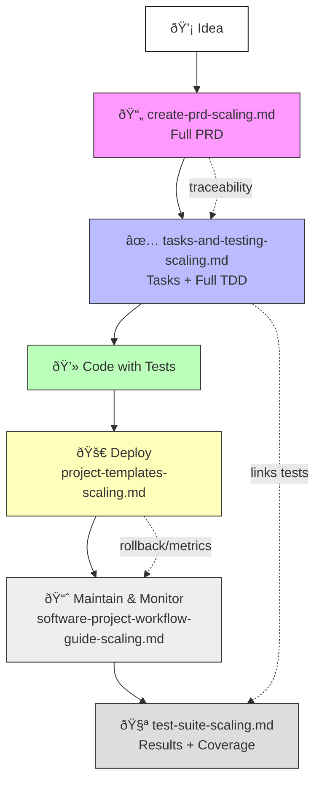

# Scaling Workflow Diagram (6 Docs)

```mermaid
flowchart TD
    A[💡 Idea] --> B[📄 create-prd-scaling.md<br/>Full PRD]
    B --> C[✅ tasks-and-testing-scaling.md<br/>Tasks + Full TDD]
    C --> D[💻 Code with Tests]
    D --> E[🚀 Deploy<br/>project-templates-scaling.md]
    E --> F[📈 Maintain & Monitor<br/>software-project-workflow-guide-scaling.md]
    F --> G[🧪 test-suite-scaling.md<br/>Results + Coverage]

    %% cross-links
    B -. traceability .-> C
    C -. links tests .-> G
    E -. rollback/metrics .-> F

    style A fill:#fff,stroke:#000,stroke-width:1px
    style B fill:#f9f,stroke:#333,stroke-width:1px
    style C fill:#bbf,stroke:#333,stroke-width:1px
    style D fill:#bfb,stroke:#333,stroke-width:1px
    style E fill:#ffb,stroke:#333,stroke-width:1px
    style F fill:#eee,stroke:#333,stroke-width:1px
    style G fill:#ddd,stroke:#333,stroke-width:1px
```
