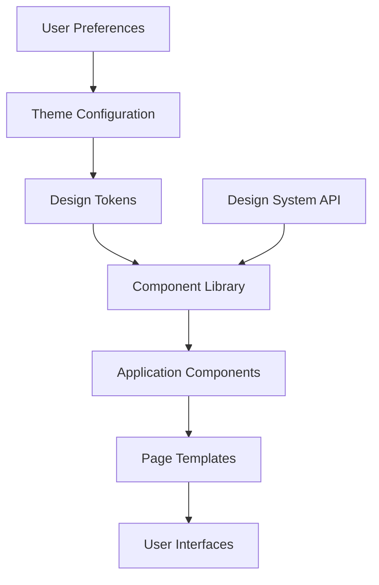

# Project Templates Library (Scaling - Design-Aware)

## Objective
Provide **comprehensive templates** with design system integration to support quality, traceability, maintainability, and design consistency for scaling projects. Templates include agentic workflow integration with proper context seeding and validation.

---

## Enhanced Template Categories

### Foundation Templates
- **Project Charter (Design-Aware)** - Project foundation with design system requirements
- **MVP-to-Scaling Transition Plan** - Structured migration from MVP to scaling workflow
- **Design System Specification** - Component library and design token standards

### Requirements & Design Templates  
- **Full PRD (Design-Enhanced)** - Product requirements with comprehensive design context
- **Design Analysis Document** - Component inventory and integration planning
- **Design Recovery Plan** - Systematic design debt resolution

### Technical & Architecture Templates
- **Architecture Specification (Design-Integrated)** - System architecture with design system integration
- **Component Library Documentation** - Design system component specifications
- **API Design Standards** - Consistent API patterns and conventions

### Implementation Templates
- **Task Definition (Design-Aware)** - Enhanced task breakdown with design validation
- **TDD Implementation Guide** - Design system integrated test-driven development
- **Quality Assurance Plan** - Comprehensive testing including design compliance

### Deployment & Operations Templates
- **Deployment Plan (Design-Monitored)** - Deployment with design system monitoring
- **Performance Monitoring Plan** - Design system performance and bundle tracking
- **Design System Governance** - Ongoing design system maintenance and evolution

---

## Enhanced Architecture Template (Design-Integrated)

```markdown
# System Architecture Document (Design-Aware)

## Executive Summary
- **Project**: [Project Name]
- **Architecture Type**: [Monolithic|Microservices|Micro-frontends|Hybrid]
- **Design System Integration**: [Centralized|Distributed|Federated]
- **Target Scale**: [Users, requests/sec, data volume]

## Design System Architecture

### Component Library Structure
- **Atomic Components**: [buttons, inputs, icons, typography]
- **Molecular Components**: [search bars, form fields, cards]
- **Organism Components**: [headers, forms, data tables]
- **Template Components**: [page layouts, dashboard layouts]

### Design Token Management
- **Token Categories**: [colors, typography, spacing, elevation, motion]
- **Token Distribution**: [CSS custom properties, JSON, platform-specific]
- **Token Versioning**: [semantic versioning strategy]
- **Token Governance**: [approval process, breaking change management]

### Component Distribution
- **Package Strategy**: [monorepo, separate packages, CDN distribution]
- **Version Management**: [component versioning, dependency management]
- **Documentation Platform**: [Storybook, custom docs, integrated docs]

## System Components

### Frontend Architecture
- **Framework**: [React, Vue, Angular, Vanilla]
- **State Management**: [Redux, Context, Zustand, local state]
- **Styling Strategy**: [CSS-in-JS, CSS Modules, SCSS, design tokens]
- **Build System**: [Webpack, Vite, Rollup, Parcel]
- **Bundle Strategy**: [code splitting, lazy loading, tree shaking]

### Backend Architecture  
- **API Design**: [REST, GraphQL, gRPC]
- **Service Architecture**: [monolithic, microservices, serverless]
- **Database Strategy**: [relational, document, key-value, graph]
- **Caching Strategy**: [in-memory, distributed, CDN]

### Design System Infrastructure
- **Design Tool Integration**: [Figma, Sketch, Adobe XD]
- **Code Generation**: [design tokens to code, component scaffolding]
- **Testing Infrastructure**: [visual regression, accessibility, performance]
- **Documentation Generation**: [automated docs, example generation]

## Data Flow & Integration

### Component Data Flow


### API Integration Patterns
- **Component API Consistency**: [prop naming, event handling, composition]
- **Data Fetching Patterns**: [REST integration, GraphQL integration, caching]
- **Error Handling Patterns**: [error boundaries, fallback components, error states]
- **Loading State Patterns**: [skeleton screens, spinners, progressive loading]

## Scalability Considerations

### Performance Requirements
- **Bundle Size Budgets**: [total bundle size, component bundle sizes]
- **Render Performance**: [Time to Interactive, Largest Contentful Paint]
- **Component Performance**: [render time budgets, memory usage]
- **Design Token Performance**: [CSS custom property usage, runtime cost]

### Design System Scalability
- **Component Scalability**: [component composition, variant management]
- **Token Scalability**: [token organization, naming conventions]
- **Documentation Scalability**: [automated generation, maintenance]
- **Governance Scalability**: [approval processes, quality gates]

### Infrastructure Scalability
- **CDN Strategy**: [component distribution, asset optimization]
- **Caching Strategy**: [component caching, token caching]
- **Monitoring Strategy**: [performance monitoring, usage analytics]

## Security & Compliance

### Design System Security
- **Component Security**: [XSS prevention, input sanitization]
- **Token Security**: [secure token distribution, access controls]
- **Documentation Security**: [access controls, sensitive information]

### Accessibility Compliance
- **WCAG Compliance**: [2.1 AA compliance requirements]
- **Testing Strategy**: [automated testing, manual testing]
- **Documentation Requirements**: [accessibility documentation, examples]

### Performance Compliance
- **Performance Budgets**: [bundle size limits, render time limits]
- **Monitoring Requirements**: [performance tracking, alerting]
- **Optimization Requirements**: [lazy loading, code splitting]

## Quality Assurance

### Design System Testing
- **Unit Testing**: [component behavior, API compliance]
- **Integration Testing**: [component interactions, data flow]
- **Visual Regression Testing**: [component appearance, responsive behavior]
- **Accessibility Testing**: [WCAG compliance, keyboard navigation]
- **Performance Testing**: [bundle analysis, render performance]

### Continuous Integration
- **Build Pipeline**: [component building, token generation]
- **Testing Pipeline**: [automated testing, quality gates]
- **Documentation Pipeline**: [docs generation, example validation]
- **Deployment Pipeline**: [component distribution, version management]

## Deployment & Operations

### Component Library Deployment
- **Distribution Strategy**: [npm packages, CDN, git submodules]
- **Version Management**: [semantic versioning, breaking change communication]
- **Rollback Strategy**: [version pinning, emergency rollback procedures]

### Design System Monitoring
- **Usage Analytics**: [component usage, adoption metrics]
- **Performance Monitoring**: [bundle size tracking, render performance]
- **Error Monitoring**: [component errors, integration issues]
- **User Feedback**: [design system feedback, improvement requests]

## Governance & Maintenance

### Design System Team Structure
- **Core Team**: [maintainers, decision makers]
- **Contributors**: [component developers, documentation writers]
- **Stakeholders**: [designers, product teams, engineering teams]

### Change Management Process
- **RFC Process**: [design system changes, breaking changes]
- **Review Process**: [design review, code review, accessibility review]
- **Release Process**: [version planning, communication, migration support]
- **Deprecation Process**: [deprecation timeline, migration support]

## Migration & Evolution

### Migration Strategy
- **Component Migration**: [legacy component replacement, gradual migration]
- **Token Migration**: [design token adoption, CSS variable migration]
- **Documentation Migration**: [legacy docs replacement, content migration]

### Evolution Planning
- **Roadmap**: [planned features, improvements, platform expansion]
- **Research & Development**: [new patterns, emerging technologies]
- **Community Feedback**: [user feedback integration, contribution management]
```

---

## Enhanced Deployment Template (Design-Monitored)

```markdown
# Deployment Plan (Design System Integrated)

## Deployment Overview
- **Project**: [Project Name]
- **Environment**: [Development|Staging|Production]
- **Design System Version**: [version number]
- **Deployment Type**: [Blue-Green|Rolling|Canary|Feature Flag]

## Pre-Deployment Validation

### Design System Compliance
- [ ] All components use design tokens (0 hardcoded values)
- [ ] Component APIs follow established conventions
- [ ] Accessibility testing passes (WCAG 2.1 AA)
- [ ] Visual regression tests pass
- [ ] Performance budgets met (bundle size, render time)

### Quality Gates
- [ ] Unit test coverage >90%
- [ ] Integration test coverage >80%
- [ ] Visual regression tests pass
- [ ] Accessibility compliance validated
- [ ] Performance benchmarks met
- [ ] Design system compliance verified

## Deployment Environments

### Development Environment
- **Purpose**: Feature development and testing
- **Design System**: Latest development version
- **Monitoring**: Development metrics, error tracking
- **Access**: Development team, QA team

### Staging Environment  
- **Purpose**: Production-like testing and validation
- **Design System**: Release candidate version
- **Monitoring**: Production-like monitoring, performance testing
- **Access**: QA team, stakeholders, beta users

### Production Environment
- **Purpose**: Live user traffic
- **Design System**: Stable release version
- **Monitoring**: Full production monitoring, alerting
- **Access**: End users, support team

## Deployment Steps

### 1. Pre-Deployment
- [ ] Validate design system dependencies
- [ ] Check component version compatibility
- [ ] Verify environment configuration
- [ ] Backup current deployment

### 2. Design System Deployment
- [ ] Deploy design token updates
- [ ] Deploy component library updates  
- [ ] Validate design system integration
- [ ] Test component functionality

### 3. Application Deployment
- [ ] Deploy application code
- [ ] Validate design system usage
- [ ] Test critical user flows
- [ ] Verify performance metrics

### 4. Post-Deployment Validation
- [ ] Validate design consistency
- [ ] Check accessibility compliance
- [ ] Monitor performance metrics
- [ ] Verify error rates

## Rollback Strategy

### Immediate Rollback Triggers
- **Design System Issues**: Component failures, visual regressions
- **Accessibility Issues**: WCAG compliance failures
- **Performance Issues**: Bundle size increase >10%, render time increase >20%
- **Error Rate**: Error rate increase >5%

### Rollback Procedures
1. **Component-Level Rollback**: Revert specific component versions
2. **Design System Rollback**: Revert entire design system version
3. **Application Rollback**: Revert application to previous version
4. **Emergency Rollback**: Immediate revert with post-mortem

## Design System Monitoring

### Performance Metrics
- **Bundle Size**: Total bundle size, component bundle sizes
- **Render Performance**: Time to Interactive, First Contentful Paint
- **Memory Usage**: Component memory footprint, memory leaks
- **Network Performance**: Asset loading time, cache hit rates

### Usage Analytics
- **Component Usage**: Most/least used components, adoption rates
- **Design Token Usage**: Token usage patterns, hardcoded value detection
- **Accessibility Metrics**: Compliance scores, accessibility errors
- **User Experience**: User satisfaction, usability metrics

### Error Monitoring
- **Component Errors**: JavaScript errors, React errors, console warnings
- **Design System Errors**: Token resolution failures, component API errors
- **Accessibility Errors**: WCAG violations, keyboard navigation issues
- **Performance Errors**: Bundle size violations, render performance issues

### Alerting Configuration
- **Critical Alerts**: Component failures, accessibility violations
- **Warning Alerts**: Performance degradation, unusual usage patterns
- **Info Alerts**: New component usage, design token adoption

## Success Criteria
- [ ] Zero design system compliance violations
- [ ] All accessibility requirements met (WCAG 2.1 AA)
- [ ] Performance budgets maintained
- [ ] Error rates within acceptable thresholds
- [ ] User experience metrics maintained or improved
```

---

## AI Agent Directives
- Always use design-aware templates for scaling projects
- Validate design system integration in all architecture and deployment plans
- Require comprehensive monitoring for design system compliance and performance
- Ensure accessibility and performance requirements are included in all templates
- Integrate component library and design token management into all technical templates
- Reference and build upon existing design system artifacts and decisions
Set reasoning_effort = high; scaling templates require comprehensive design integration

---

## Human Review Gate (Required)
- Confirm: templates include comprehensive design system integration
- Confirm: accessibility and performance requirements properly specified
- Confirm: monitoring and governance processes adequate for scaling
- Confirm: deployment procedures include design system validation
- Confirm: architecture supports design system scalability requirements
- Approve template usage for scaling project implementation

---

## Integration with Scaling Workflow
These templates integrate with the scaling workflow:
- Support transition planning from `mvp-to-scaling-transition.md`
- Implement design standards from `gen-design-system-scaling.md`
- Provide structure for recovery planning in `gen-design-recovery-scaling.md`
- Support comprehensive testing from `test-suite-scaling.md`

---

## Template Usage Guidelines
- Use design-aware templates for all scaling projects
- Customize templates based on specific project requirements
- Maintain design system integration throughout template usage
- Validate template compliance with established design standards
- Update templates as design system and workflow evolve  
